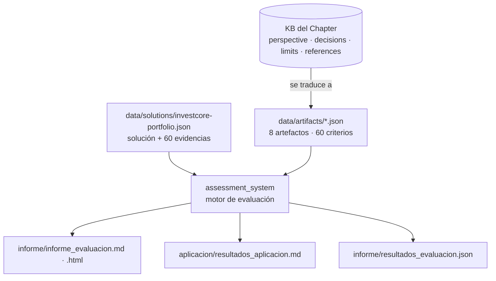
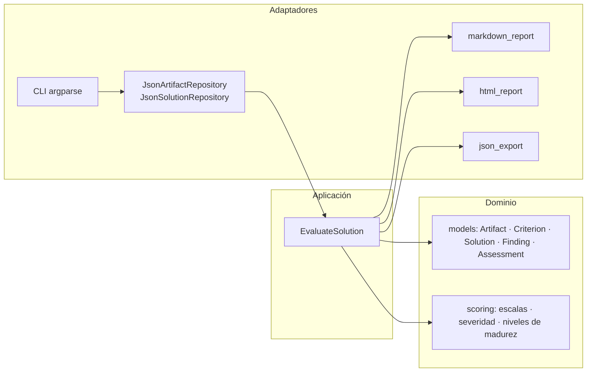

# Implementación de un sistema de evaluación de soluciones empresariales

El capítulo de arquitectura ha proporcionado una serie de artefactos de assessment para evaluar soluciones empresariales. Necesitas implementar un sistema que utilice estos artefactos para evaluar una solución de gestión de portafolio de inversiones. El sistema debe ser capaz de aplicar los artefactos de assessment de manera efectiva y proporcionar un informe detallado de la evaluación.

## Informacion General

| Campo | Valor |
|-------|-------|
| **Tema** | Utilización de artefactos de assessment |
| **Nivel** | master-l3 |
| **Tipo** | practical |
| **Tiempo estimado** | 4-6 horas |

## Fases del Reto

### Fase 0: Configuración del Proyecto

**Objetivo:** Obtener el proyecto base funcional enviando el Código Base a un asistente de IA, que lo analizará, corregirá errores y generará un ZIP listo para usar.

**Tiempo estimado:** 15-30 minutos

**Instrucciones:**

- Asegúrate de tener instalado para ejecutar el proyecto: Un IDE o editor de código.
- Copia todo el contenido del campo **Código Base** de este reto — incluyendo el texto de instrucciones que aparece al inicio.
- Abre un asistente de IA (Claude en claude.ai, ChatGPT o Gemini — se recomienda Claude), pega el contenido copiado en el chat y envíalo.
- El asistente analizará los archivos, corregirá errores y generará un archivo ZIP descargable. Descárgalo y extráelo en la carpeta donde quieras trabajar.
- Verifica que el proyecto arranca sin errores.

**Entregable:** El proyecto compila/arranca sin errores.

<details>
<summary>Pistas de conocimiento</summary>

- Copia el Código Base completo incluyendo el texto de instrucciones al inicio — esas instrucciones le indican al asistente exactamente qué hacer con los archivos.
- Si el asistente no genera el ZIP automáticamente al terminar el análisis, escríbele: "genera el ZIP ahora".
- Si el proyecto tiene errores al arrancar, comparte el mensaje de error con el mismo asistente para que lo corrija.

</details>

### Fase 1: Exploración de los artefactos de assessment

**Objetivo:** Entender y documentar los artefactos de assessment proporcionados por el capítulo de arquitectura.

**Tiempo estimado:** 1 hora

**Instrucciones:**

- Analiza los artefactos de assessment proporcionados.
- Documenta cada artefacto, describiendo su propósito y cómo se aplica en la evaluación de soluciones empresariales.

**Entregable:** Documentación detallada de los artefactos de assessment.

<details>
<summary>Pistas de conocimiento</summary>

- Considera cómo cada artefacto contribuye a la evaluación integral de una solución.
- Piensa en cómo los artefactos se relacionan entre sí y cómo se pueden aplicar juntos.

</details>

### Fase 2: Aplicación de los artefactos en una solución de gestión de portafolio de inversiones

**Objetivo:** Aplicar los artefactos de assessment a una solución de gestión de portafolio de inversiones.

**Tiempo estimado:** 2 horas

**Instrucciones:**

- Selecciona una solución de gestión de portafolio de inversiones.
- Aplica cada artefacto de assessment a la solución seleccionada.
- Documenta el proceso de aplicación y los resultados obtenidos.

**Entregable:** Documentación del proceso de aplicación de los artefactos de assessment y los resultados obtenidos.

<details>
<summary>Pistas de conocimiento</summary>

- Considera los posibles desafíos y soluciones al aplicar los artefactos a la solución seleccionada.
- Piensa en cómo los resultados de la evaluación pueden mejorar la solución.

</details>

### Fase 3: Generación de un informe de evaluación

**Objetivo:** Generar un informe detallado de la evaluación utilizando los artefactos de assessment.

**Tiempo estimado:** 1 hora

**Instrucciones:**

- Compila los resultados de la aplicación de los artefactos de assessment.
- Genera un informe detallado que incluya los hallazgos, conclusiones y recomendaciones basadas en la evaluación.
- Asegúrate de que el informe sea claro, conciso y útil para los tomadores de decisiones.

**Entregable:** Informe detallado de la evaluación utilizando los artefactos de assessment.

<details>
<summary>Pistas de conocimiento</summary>

- Considera cómo presentar los resultados de manera efectiva para los tomadores de decisiones.
- Piensa en cómo las recomendaciones pueden ayudar a mejorar la solución.

</details>

## Dimensiones Evaluadas

- **queEs**: ¿Qué son los artefactos de assessment y cuál es su propósito?
- **paraQueSirve**: ¿Para qué sirven los artefactos de assessment en la evaluación de soluciones empresariales?
- **comoSeUsa**: ¿Cómo se aplican los artefactos de assessment a una solución de gestión de portafolio de inversiones?
- **erroresComunes**: ¿Qué errores comunes se pueden encontrar al aplicar los artefactos de assessment?
- **queDecisionesImplica**: ¿Qué decisiones implica la generación de un informe de evaluación utilizando los artefactos de assessment?

## Criterios de Evaluacion

- Documentación detallada de los artefactos de assessment.
- Aplicación de los artefactos a una solución de gestión de portafolio de inversiones.
- Generación de un informe detallado de la evaluación.

---

*Reto generado automaticamente por Challenge Generator - Pragma*

---

# Solución implementada

> Fork de trabajo: <https://github.com/4dagio/challenge-fd984ffc-9e57-4efd-be48-69d39273d3bc>

## Idea central

Los tres artefactos genéricos del código base se reemplazaron por **ocho artefactos concretos
derivados de la base de conocimiento oficial del Chapter de Arquitectura**
(`sopp-chapter-arquitectura-doc-md-kb`): su perspectiva, sus 9 decisiones (ADRs), sus 10 límites,
y sus referencias (workflow de diseño, Definition of Done, estándar de documentación, guía de
observabilidad). Un sistema de evaluación en Python **aplica esos artefactos como datos** sobre una
solución de gestión de portafolio de inversiones descrita con evidencias, y genera el informe.



## Cómo ejecutar

Requiere únicamente **Python 3.11+** (sin dependencias externas).

```bash
python3 -m assessment_system list-artifacts     # lista los 8 artefactos y sus criterios
python3 -m assessment_system validate           # valida esquema, pesos y cobertura de evidencias
python3 -m assessment_system evaluate           # aplica los artefactos y genera los informes
python3 -m unittest discover -s tests -v        # 29 pruebas
```

`evaluate` acepta `--artifacts DIR`, `--solution FILE`, `--out DIR` y `--format md|html|json|all`,
de modo que el mismo sistema evalúa cualquier otra solución descrita con el mismo esquema.

## Estructura del repositorio

| Ruta | Contenido |
|---|---|
| `assessment_system/domain/` | Modelo (artefacto, criterio, solución, hallazgo) y reglas de puntuación puras |
| `assessment_system/application/` | Caso de uso `EvaluateSolution`: aplica artefactos, deriva severidad, gates, mapa de calor y hoja de ruta |
| `assessment_system/adapters/` | Carga JSON, informes Markdown, HTML y JSON |
| `assessment_system/__main__.py` | CLI |
| `data/artifacts/` | Los 8 artefactos de assessment (A01-A08) |
| `data/solutions/` | La solución evaluada con sus evidencias |
| `tests/` | Pruebas unitarias, de caso de uso y de integridad de datos |
| `artefactos/documentacion_artefactos.md` | **Fase 1** — documentación detallada de los artefactos |
| `aplicacion/aplicacion_artefactos.md` | **Fase 2** — proceso de aplicación, desafíos y lectura de resultados |
| `aplicacion/resultados_aplicacion.md` | **Fase 2** — registro criterio por criterio (generado) |
| `informe/informe_evaluacion.md` | **Fase 3** — informe para tomadores de decisión (generado) |
| `informe/informe_evaluacion.html` | **Fase 3** — versión HTML autocontenida (generada) |
| `entregables/codigo-base-fase0.zip` | **Fase 0** — resultado de aplicar `PROMPT_MEJORA.md` al código base |

## Arquitectura del sistema de evaluación

El sistema sigue los lineamientos que evalúa: arquitectura limpia (dominio sin dependencias,
adaptadores en el borde), artefactos como datos versionables (docs-as-code, "AI-Ready"), y
pruebas que protegen las reglas (los pesos deben sumar 1.0, toda evidencia debe corresponder a un
criterio, todo criterio debe trazar a la KB).



**Reglas de puntuación** (viven en el dominio, los artefactos solo declaran qué se mide):

- Cinco escalas normalizadas a 0..1: madurez 0-4, pass/partial/fail, compliant/at-risk/violated,
  aligned/justified-deviation/partial/unjustified-deviation, y escenario medido vs objetivo.
- Severidad = f(criticidad del criterio, puntaje). Sin evidencia también es hallazgo.
- Bloqueantes: límite violado o verificación crítica fallida en un gate. Deciden el veredicto por
  encima del promedio.
- Puntaje global = suma ponderada por artefacto; nivel de madurez de 1 (Inicial) a 5 (Optimizado).
- Hoja de ruta: recomendaciones agrupadas por tema y ubicadas en horizontes por severidad máxima.

## Resultado de la evaluación (resumen)

| Indicador | Valor |
|---|---|
| Solución | InvestCore — Plataforma de Gestión de Portafolio de Inversiones |
| Puntaje global | 48.1 / 100 — Nivel 2 Gestionado |
| Veredicto | NO APTO para nuevas liberaciones críticas sin plan de remediación |
| Quality gate DoD | No superado (1/10) |
| Hallazgos | 8 críticos · 16 altos · 25 medios · 4 bajos · 6 bloqueantes |

El informe completo está en [`informe/informe_evaluacion.md`](informe/informe_evaluacion.md).

## Fase 0 — aplicación de `PROMPT_MEJORA.md`

El código base contenía únicamente tres archivos Markdown (tipo B, documentación) y ningún código
fuente ni archivo de build, por lo que no había errores de compilación que corregir. Siguiendo las
reglas del prompt, los archivos se extrajeron sin modificaciones y se empaquetaron con la
estructura de rutas original en `entregables/codigo-base-fase0.zip`, junto con una nota
(`FASE0_RESULTADO.md`) que documenta la clasificación. Los vacíos de contenido (artefactos sin
nombre ni criterios) se clasificaron como 🟡 problemas de calidad y se preservaron, ya que resolverlos
es el objetivo de las Fases 1 a 3.
