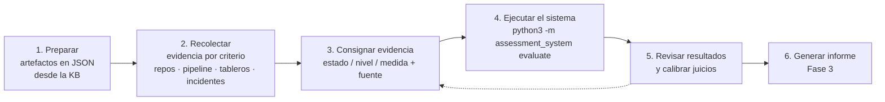

# Aplicación de los Artefactos de Assessment a una Solución de Gestión de Portafolio de Inversiones

> **Fase 2 del reto.** Este documento describe la solución seleccionada, el proceso seguido para
> aplicar cada artefacto, los desafíos encontrados y los resultados obtenidos. El registro
> criterio por criterio (evidencia, fuente, puntaje) lo genera el sistema en
> [`resultados_aplicacion.md`](resultados_aplicacion.md); aquí se documenta el **proceso** y la
> **lectura** de esos resultados.

## 1. Solución seleccionada

**InvestCore — Plataforma de Gestión de Portafolio de Inversiones** (caso de estudio para una
fiduciaria). Se eligió porque reúne las tensiones típicas de una solución empresarial del sector
financiero, que es el contexto de los clientes del Chapter:

- **Escala y carga variable:** 250.000 portafolios, ingesta de precios en tiempo real, picos en
  apertura y cierre de mercado, un batch regulatorio con ventana fija.
- **Seguridad y cumplimiento:** datos personales y financieros, auditabilidad de órdenes ante el
  regulador, integración con brokers y custodios.
- **Arquitectura distribuida real:** siete microservicios Java sobre AWS EKS, Kafka, persistencia
  políglota (PostgreSQL, MongoDB, Redis) y una capa anticorrupción hacia un core heredado.
- **Historia operativa:** dos incidentes mayores recientes (caída del proveedor de precios y OOM
  del batch) que permiten evaluar con evidencia, no con hipótesis.

La descripción completa (actores, sistemas externos, contenedores y ADRs locales) está en
`data/solutions/investcore-portfolio.json` y se reproduce en el registro generado.

## 2. Proceso de aplicación



### Paso 1. Preparar los artefactos

Cada artefacto de la KB se tradujo a criterios con identificador, escala, criticidad, tema,
recomendación y referencia a su fuente (ver `artefactos/documentacion_artefactos.md`). El
comando `validate` confirma que los pesos suman 1.0 y que toda evidencia corresponde a un
criterio:

```
Artefactos: 8 · Criterios: 60 · Evidencias: 60
✅ Cobertura completa: toda evidencia corresponde a un criterio y viceversa.
```

### Paso 2. Recolectar evidencia

Por cada artefacto se definió **dónde buscar**:

| Artefacto | Fuentes de evidencia usadas |
|---|---|
| A01 Perspectiva | Estructura de paquetes de los repositorios, ADRs locales, SAD, backlog e inventario de deuda, entrevistas con líder técnico y SRE |
| A02 Workflow | Tablero de Event Storming, SAD (secciones de contexto, NFR, vistas), repositorio de ADRs, definición del pipeline, repositorio de IaC |
| A03 Escenarios | Reportes K6 (consulta con 4.500 VUs, ingesta de precios), métricas CloudWatch del batch, informe mensual de disponibilidad, postmortems INC-2026-071 y 088, prueba DAST OWASP ZAP, ejercicio DR de junio, historial de la épica de notas estructuradas, prueba de auditoría con cumplimiento |
| A04 DoD | SonarQube (cobertura, vulnerabilidades), configuración del pipeline GitLab CI, código de clientes HTTP, muestras de logs, catálogo OpenAPI vs código |
| A05 Límites | Señales de alerta de cada límite: postmortems, `application.yml` y datasources, historial git (secretos), manifiestos Helm, métricas de Hikari y de lag MSK, configuración de ingress y NetworkPolicies |
| A06 ADRs | ADRs locales (ADR-INV-01 a 09) contrastados con la implementación real |
| A07 Documentación | SAD, Confluence, catálogo de APIs, Schema Registry |
| A08 Observabilidad | Trazas X-Ray, configuración de productores Kafka, muestras de logs, tableros Grafana, reglas de alertas |

### Paso 3. Consignar la evidencia

Cada criterio recibió **estado, nivel o medida**, un **texto de evidencia** verificable y la
**fuente**. Regla adoptada: si no se pudo verificar, se deja sin evidencia y el sistema lo reporta
como hallazgo; nunca se asume cumplimiento.

### Paso 4. Ejecutar el sistema

```bash
python3 -m assessment_system evaluate
```

El sistema aplica las escalas, deriva severidades, evalúa el gate, agrega por artefacto y por
atributo de calidad, y genera los cuatro entregables (`informe_evaluacion.md`, `.html`,
`resultados_evaluacion.json` y `resultados_aplicacion.md`).

### Paso 5. Revisar y calibrar

Se revisaron los resultados con dos preguntas: ¿el puntaje refleja la evidencia? y ¿la severidad
es proporcional al impacto? Dos calibraciones surgieron de esta revisión y quedaron en los
artefactos, no en el código: OBS-02 pasó a criticidad alta (PII en logs es un problema de
cumplimiento) y ADR-008 quedó como desviación justificada (el ADR local documenta el trade-off).

## 3. Desafíos encontrados y cómo se resolvieron

| Desafío | Cómo se resolvió |
|---|---|
| La solución no tenía escenarios de calidad formales (WF-02 parcial), así que A03 no tenía contra qué medir. | Se construyeron los nueve escenarios durante la evaluación a partir de las prioridades de calidad del negocio y se dejaron como propuesta de SLOs. El hallazgo WF-02 se mantiene porque el método no existía antes. |
| Varios artefactos señalan el mismo problema (secretos en DOD-03, LIM-006 y ADR-007; base compartida en VAL-02, LIM-002 y ADR-002). | Se conservan los tres hallazgos porque responden a preguntas distintas (¿está terminado?, ¿hay riesgo conocido?, ¿hay gobierno?), y la hoja de ruta los consolida por tema en una sola acción. |
| Tentación de calificar la rúbrica de perspectiva (A01) por impresión general. | Los niveles de madurez se redactaron como hechos observables y cada nivel asignado cita la evidencia concreta (por ejemplo, "4 servicios tocados, 18 días-persona"). |
| Distinguir desviación aceptable de desviación silenciosa en A06. | Se exigió el ADR local: ADR-INV-07 justifica el batch en EKS con trade-offs y puntúa 0.75; ADR-INV-09 (esquema compartido) está sin aprobar y sin fecha de salida, por lo que la desviación se considera no justificada. |
| Evidencia parcial en escenarios: la medida existe pero el entorno no coincide exactamente con el declarado (por ejemplo, QAS-05 medido en un incidente real, no en una prueba de caos). | Se registró la medida disponible con su fuente y se recomendó institucionalizar la prueba de caos para que la próxima evaluación tenga la medida en el entorno declarado. |
| Determinar si un límite está "en riesgo" o "violado" cuando hay señales pero no incidente (LIM-007 sin mTLS). | Se aplicó la definición del artefacto: violado si la restricción se incumple; en riesgo si hay señales tempranas con mitigaciones parciales (NetworkPolicies). La recomendación es la misma; cambia la urgencia. |

## 4. Resultados obtenidos

### Resultado global

| Indicador | Valor |
|---|---|
| Puntaje global | **48.1 / 100** |
| Nivel de madurez | **Nivel 2 - Gestionado** |
| Veredicto | **NO APTO para nuevas liberaciones críticas sin plan de remediación** |
| Quality gate (DoD) | ❌ No superado (1 de 10 verificaciones en `pass`) |
| Hallazgos | 8 críticos · 16 altos · 25 medios · 4 bajos |
| Bloqueantes | 6 (5 límites violados + DOD-03 secretos) |

### Resultado por artefacto

| Artefacto | Puntaje | Lectura |
|---|---:|---|
| A01 Perspectiva y valores | 53.1 | Equipo con buen dominio del negocio (VAL-06) y simplicidad (VAL-03), pero acoplamiento por datos (VAL-02 nivel 1) y gobierno inmaduro (ADRs, deuda, SLOs en nivel 2). |
| A02 Workflow de diseño | 41.7 | El método se aplicó parcialmente en 2024 y no se sostuvo: sin ASRs formales, sin fitness functions, quality gates no bloqueantes. |
| A03 Escenarios de calidad | 69.6 | Solo la auditabilidad (QAS-09) cumple. Escalabilidad y resiliencia son las brechas: p95 de 2.650 ms con +50% usuarios, batch en 41 min contra 30, degradación en 90 s contra 5. |
| A04 Definition of Done | 40.0 | Gate no superado. Tres fallos (fitness functions, secretos, deuda) y seis parciales. Solo el code review cumple. |
| A05 Catálogo de límites | 30.0 | Cinco límites violados (cascada, base compartida, secretos, backpressure, retry storm); cuatro en riesgo; solo contratos frágiles cumple gracias a Pact. |
| A06 Conformidad ADRs | 52.8 | Alineado en asincronía, caché y protocolos; desviaciones no justificadas en database-per-service, service mesh y secretos; una desviación bien justificada (batch en EKS). |
| A07 Documentación | 50.0 | Contexto correcto, contenedores incompletos, diagramas fuera del repositorio, eventos sin AsyncAPI. |
| A08 Observabilidad | 37.5 | Trazabilidad rota en Kafka y batch, PII en logs de extractos, sin KPIs de negocio ni alertas de anomalías/FinOps. |

### Lectura por las tres dimensiones del enunciado

- **Arquitectura (Artefacto 1).** La solución tiene una base sólida: contextos identificados,
  hexagonal en 5 de 7 servicios, eventos para los flujos de negocio, event sourcing en órdenes.
  Su problema es la **erosión no vigilada**: el esquema compartido entre portafolio y reportería
  convirtió parte del sistema en un monolito distribuido y nada en el pipeline lo impide.
- **Escalabilidad (Artefacto 2).** Con 50% más usuarios la plataforma degrada (p95 2.650 ms) porque
  valora en línea por cada consulta; el batch no cabe en la ventana regulatoria y la ingesta se
  atasca a 14.000 ticks/s por falta de backpressure. Son problemas de **diseño de flujo**, no de
  infraestructura: la recomendación central es CQRS con proyecciones alimentadas por eventos.
- **Seguridad (Artefacto 3).** Los hallazgos más graves son operativos y de cumplimiento:
  credenciales en repositorios, tráfico interno sin identidad, dos endpoints internos sin
  autorización y datos personales en logs. Ninguno requiere rediseño; todos requieren decisión y
  disciplina de pipeline.

### Cómo los resultados mejoran la solución

La hoja de ruta generada (sección 6 del informe) agrupa 60 criterios en 14 temas y 4 horizontes.
En **0-30 días** se cierran los cuatro temas críticos con esfuerzo mayoritariamente bajo o medio
(secretos, resiliencia de clientes salientes, backpressure y datos compartidos). Se simularon dos
escenarios re-ejecutando el sistema con las evidencias corregidas:

| Escenario simulado | Puntaje | A05 Límites | Veredicto |
|---|---:|---:|---|
| Situación actual | 48.1 | 30.0 | NO APTO |
| Solo se corrigen los 5 límites violados y los secretos (DOD-03) | 57.1 | 80.0 | NO APTO: persisten desviaciones no justificadas de criticidad alta (ADR-002, ADR-007) |
| Se ejecutan los cuatro temas críticos completos, incluidos los ADRs locales que formalizan las desviaciones y las mejoras de flujo que cumplen QAS-01/02/04/05 | 65.4 | 80.0 | APTO CON CONDICIONES (el gate del DoD sigue abierto) |

La lectura para el comité es que **la remediación técnica sin gobierno no cambia el veredicto**:
el Chapter exige que toda desviación quede registrada con sus trade-offs, y el sistema lo refleja.

## 5. Entregables de esta fase

| Archivo | Contenido | Generación |
|---|---|---|
| `aplicacion/aplicacion_artefactos.md` | Este documento: solución, proceso, desafíos, lectura de resultados | Manual |
| `aplicacion/resultados_aplicacion.md` | Registro criterio por criterio: evidencia, fuente, detalle, puntaje, hallazgos | Automática (`evaluate`) |
| `data/solutions/investcore-portfolio.json` | Descripción de la solución y las 60 evidencias consignadas | Manual (insumo) |
| `informe/resultados_evaluacion.json` | Resultados en formato máquina | Automática (`evaluate`) |
