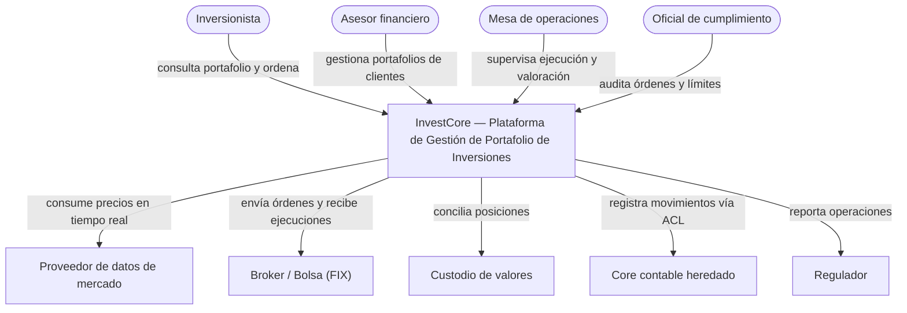

# Aplicación de los Artefactos de Assessment — InvestCore — Plataforma de Gestión de Portafolio de Inversiones

*Generado el 2026-09-08T15:03 -05 por el sistema de evaluación. Este documento registra, criterio por criterio, la evidencia aportada, la fuente de la evidencia y la puntuación obtenida al aplicar cada artefacto.*

## Solución evaluada

| Campo | Valor |
|---|---|
| Nombre | InvestCore — Plataforma de Gestión de Portafolio de Inversiones |
| Cliente | Fiduciaria Andina (caso de estudio) |
| Dominio | Gestión de portafolios de inversión: administración de portafolios, ejecución de órdenes, valoración, riesgo y cumplimiento, y reportería a clientes |
| Versión evaluada | 2026.08 (release 14) |
| Prioridades de calidad | seguridad, disponibilidad, rendimiento, escalabilidad, cumplimiento, mantenibilidad |

### Contexto (C4 Nivel 1 y Nivel 2)

| Contenedor | Tecnología | Responsabilidad |
|---|---|---|
| Web App (asesores) y App móvil (inversionistas) | React / Flutter | Canales de consulta, órdenes y reportes |
| API Gateway + BFF | AWS API Gateway, Spring Cloud Gateway | Autenticación (Cognito, MFA), enrutamiento, rate limiting parcial |
| portfolio-service | Java 21 / Spring Boot, PostgreSQL | Agregado Portafolio y Posiciones |
| order-service | Java 21 / Spring Boot, PostgreSQL (event store) | Ciclo de vida de órdenes, integración FIX con broker |
| pricing-service | Java 21 / Spring WebFlux, Redis | Ingesta de precios y caché de último precio |
| valuation-service + valuation-batch | Java 21 / Spring Boot, Kafka consumer, PostgreSQL | Valoración en línea y de fin de día |
| risk-compliance-service | Java 21 / Spring Boot, MongoDB | Límites, perfil de riesgo, alertas de cumplimiento |
| reporting-service | Java 21 / Spring Boot, PostgreSQL (esquema compartido con portfolio) | Extractos y reportes regulatorios |
| customer-service | Java 21 / Spring Boot, PostgreSQL | Datos de cliente y perfilamiento |
| Kafka (MSK) | Apache Kafka | Eventos de órdenes, precios y valoración |
| legacy-acl | Java / Spring Boot | Capa anticorrupción hacia el core contable |

### Decisiones locales (ADRs) de la solución

| ID | Título | Estado |
|---|---|---|
| ADR-INV-01 | Microservicios por Bounded Context sobre EKS | Aprobado |
| ADR-INV-03 | Kafka como bus de eventos de órdenes y valoración | Aprobado |
| ADR-INV-05 | Redis cache-aside para último precio (TTL 2 s) | Aprobado |
| ADR-INV-07 | Batch de valoración en EKS (Job) en lugar de Serverless por duración > 15 min y warm-up JVM | Aprobado |
| ADR-INV-09 | Esquema compartido portfolio/reporting como medida temporal | Propuesto (sin aprobar, sin fecha de salida) |

## Proceso de aplicación

1. **Cargar artefactos** desde `data/artifacts/` (validación de esquema, pesos y escalas).
2. **Cargar la solución** con sus evidencias desde `data/solutions/`.
3. **Aplicar cada criterio**: traducir la evidencia a una puntuación 0..1 según la escala del artefacto.
4. **Generar hallazgos** para todo criterio no cumplido, con severidad derivada de la criticidad.
5. **Agregar**: puntaje por artefacto, puntaje global ponderado, mapa de calor y gates.
6. **Construir la hoja de ruta** agrupando recomendaciones por tema y horizonte.

## A01 · Rúbrica de Perspectiva y Valores de Ingeniería

- **Propósito:** Medir qué tan alineada está la arquitectura de la solución con la mentalidad, los valores de ingeniería y los 'Dos / Don'ts' del Chapter: dominio primero, trade-offs explícitos, simplicidad y reversibilidad, validación automatizada y medibilidad.
- **Cómo se aplicó:** Cada valor se califica en una escala de madurez 0-4 a partir de evidencia estructural (código, diagramas, ADRs, backlog) y entrevistas con el equipo. El puntaje del artefacto es el promedio ponderado de los niveles.
- **Fuente del Chapter:** `kb/perspective.md`
- **Escala:** maturity · **Peso en el puntaje global:** 15%
- **Resultado:** 53.1 / 100

| ID | Criterio | Resultado | Detalle | Evidencia | Fuente |
|---|---|---|---|---|---|
| VAL-01 | Evolutividad y agilidad arquitectónica | ⚠️ Parcial | Nivel 2/4 — Existen algunos puntos de extensión pero el cambio típico cruza más de dos servicios. | La última incorporación de un instrumento (nota estructurada) tocó 4 servicios y tomó 18 días-persona; existe abstracción 'Instrument' pero la valoración por tipo está codificada con condicionales en valuation-service. | Historial de PRs Q2-2026; entrevista con líder técnico |
| VAL-02 | Desacoplamiento y alta cohesión (Bounded Contexts) | ⚠️ Parcial | Nivel 1/4 — Servicios separados pero con acoplamiento por base de datos y llamadas cruzadas. | Los contextos están separados en servicios, pero reporting-service lee directamente las tablas de portfolio-service y risk-compliance consulta customer-service de forma síncrona en cada evaluación. | Diagrama de despliegue; revisión de repositorios (datasource compartido en reporting-service/application.yml) |
| VAL-03 | Simplicidad esencial | ⚠️ Parcial | Nivel 3/4 — Cada componente tiene una razón de negocio documentada. | Inventario de componentes justificado; se detectó un servicio 'notification-orchestrator' sin uso desde 2025 que ya está marcado para retiro. | SAD sección 4; backlog INV-1187 |
| VAL-04 | Independencia tecnológica (Clean / Hexagonal) | ⚠️ Parcial | Nivel 2/4 — La mayoría de servicios aplica puertos y adaptadores; hay excepciones. | 5 de 7 servicios siguen el arquetipo hexagonal del Chapter; reporting-service y legacy-acl mezclan lógica de negocio en controladores y repositorios JPA. | Revisión estática de estructura de paquetes |
| VAL-05 | Observabilidad y medibilidad (SLIs / SLOs) | ⚠️ Parcial | Nivel 2/4 — Métricas técnicas con algunos objetivos informales. | Existen métricas RED en Grafana y un objetivo informal de p95 < 2 s; no hay SLOs formales ni presupuesto de error por capacidad de negocio. | Tableros Grafana 'investcore-services'; entrevista SRE |
| VAL-06 | El dominio dicta las reglas (DDD y lenguaje ubicuo) | ⚠️ Parcial | Nivel 3/4 — Lenguaje ubicuo documentado y reflejado en código, eventos y APIs. | Glosario ubicuo publicado (Portafolio, Posición, Orden, Ejecución, Valoración, Instrumento); los eventos Kafka y las APIs usan esos términos. Falta cubrir el contexto de cumplimiento. | docs/glosario.md; esquemas de eventos |
| VAL-07 | Decisiones formales con trade-offs explícitos (ADRs y SAD) | ⚠️ Parcial | Nivel 2/4 — ADRs para algunas decisiones; sin trade-offs explícitos. | Existen 5 ADRs locales con plantilla propia (sin sección de trade-offs económicos); decisiones como la ausencia de mesh o el esquema compartido no tienen ADR aprobado. El SAD está desactualizado (v2025.11). | Repositorio investcore-docs/adr |
| VAL-08 | Gestión activa y visible de la deuda técnica | ⚠️ Parcial | Nivel 2/4 — Deuda documentada fuera del backlog, sin priorización ni capacidad asignada. | La deuda técnica está inventariada en una página de Confluence (23 ítems) sin estimación de impacto ni capacidad reservada; no se miden métricas DORA completas. | Confluence 'Deuda técnica InvestCore'; Jira |

**Hallazgos derivados:**

- 🟡 **H-VAL-01** (Medio): Definir puntos de extensión explícitos en el dominio (estrategias por tipo de activo, reglas como configuración) y medir el costo de cambio por sprint como métrica arquitectónica. — Referencias: `kb/perspective.md`, `kb/references/v1/architectural-design-workflow.md`
- 🟠 **H-VAL-02** (Alto): Formalizar el mapa de contextos (Context Map) con relaciones explícitas y eliminar el acceso directo a datos de otros contextos mediante APIs o eventos. — Referencias: `kb/perspective.md`, `kb/limits/v1/002-shared-database-monolith.md`
- 🟢 **H-VAL-03** (Bajo): Inventariar componentes y abstracciones sin justificación de negocio y retirarlos o consolidarlos; documentar la justificación de los que permanecen. — Referencias: `kb/perspective.md`
- 🟡 **H-VAL-04** (Medio): Aplicar el arquetipo hexagonal del Chapter en los servicios que mezclan dominio e infraestructura y proteger la regla de dependencias con pruebas de arquitectura. — Referencias: `kb/perspective.md`, `kb/references/v1/architecture-definition-of-done.md`
- 🟡 **H-VAL-05** (Medio): Definir SLIs por capacidad de negocio (valoración, órdenes, reportes), fijar SLOs y publicar tableros con presupuesto de error. — Referencias: `kb/perspective.md`, `kb/decisions/v1/009-observability-full-stack.md`
- 🟡 **H-VAL-06** (Medio): Ejecutar sesiones de Event Storming con negocio, publicar el glosario ubicuo y alinear nombres de agregados, eventos y APIs con ese glosario. — Referencias: `kb/perspective.md`, `kb/references/v1/architectural-design-workflow.md`
- 🟡 **H-VAL-07** (Medio): Adoptar la plantilla de decisión del Chapter, completar los ADRs faltantes para decisiones ya tomadas y consolidar el SAD como documento vivo. — Referencias: `kb/perspective.md`, `tools/templates/kb/decision.md.template`
- 🟡 **H-VAL-08** (Medio): Crear el registro de deuda técnica en el backlog con impacto económico e interés, reservar capacidad por sprint para su pago y publicar métricas DORA. — Referencias: `kb/perspective.md`, `kb/references/v1/architecture-definition-of-done.md`

## A02 · Checklist del Flujo de Diseño Arquitectónico

- **Propósito:** Verificar que la solución fue concebida y evoluciona siguiendo las tres fases del flujo de diseño del Chapter (descubrimiento y alto nivel, diseño detallado y habilitación, verificación continua) y que existen los entregables de cada fase.
- **Cómo se aplicó:** Cada ítem del checklist se marca como pass, partial o fail según la existencia y calidad de los entregables (capacidades de negocio, ASRs con SLOs, ADRs, vistas C4, IaC y quality gates, fitness functions).
- **Fuente del Chapter:** `kb/references/v1/architectural-design-workflow.md`
- **Escala:** boolean · **Peso en el puntaje global:** 10%
- **Resultado:** 41.7 / 100

| ID | Criterio | Resultado | Detalle | Evidencia | Fuente |
|---|---|---|---|---|---|
| WF-01 | Capacidades de negocio y lenguaje ubicuo documentados | ⚠️ Parcial | Estado declarado: partial | Se realizó Event Storming en 2024 para portafolio, órdenes y valoración; los contextos de riesgo/cumplimiento y cliente se modelaron sin taller y sin mapa de capacidades actualizado. | Miro 'Event Storming InvestCore 2024'; SAD sección 2 |
| WF-02 | Atributos de calidad (ASRs) con métricas y SLOs | ⚠️ Parcial | Estado declarado: partial | Los requisitos no funcionales existen como lista textual ('alta disponibilidad', 'respuesta rápida') sin escenarios estímulo-respuesta ni SLOs formales; los escenarios de este assessment se construyeron durante la evaluación. | SAD sección 3 'Requisitos no funcionales' |
| WF-03 | ADRs explícitos para las decisiones clave | ⚠️ Parcial | Estado declarado: partial | Hay ADRs para estilo (microservicios), eventos (Kafka), caché y despliegue del batch; no hay ADR para persistencia por servicio, seguridad interna ni observabilidad. | investcore-docs/adr |
| WF-04 | Vistas C4 estandarizadas y contratos API-First | ⚠️ Parcial | Estado declarado: partial | Vistas C4 L1 y L2 existentes; sin vista de componentes para valuation-service y order-service. Contratos OpenAPI definidos antes de implementar; los eventos Kafka no tienen contrato formal. | SAD secciones 5-6; catálogo de APIs |
| WF-05 | Diseño de infraestructura y DevSecOps (IaC, topología, quality gates) | ⚠️ Parcial | Estado declarado: partial | IaC con Terraform para EKS, RDS y MSK; Redis y reglas de WAF configurados manualmente. El pipeline ejecuta SonarQube pero el quality gate no bloquea el despliegue. | Repositorio investcore-infra; definición del pipeline GitLab CI |
| WF-06 | Verificación continua: fitness functions y deuda en el backlog | ❌ No cumple | Estado declarado: fail | No existen fitness functions (sin ArchUnit ni reglas de dependencia automatizadas); la deuda no se gestiona en sprints. | Búsqueda en repositorios (0 dependencias ArchUnit); entrevista con el equipo |

**Hallazgos derivados:**

- 🟡 **H-WF-01** (Medio): Realizar Event Storming por contexto faltante y publicar el mapa de capacidades y el glosario en el repositorio de documentación. — Referencias: `kb/references/v1/architectural-design-workflow.md`
- 🟠 **H-WF-02** (Alto): Formalizar los escenarios de calidad con la plantilla estímulo-respuesta-medida y convertirlos en SLOs monitoreados. — Referencias: `kb/references/v1/architectural-design-workflow.md`
- 🟡 **H-WF-03** (Medio): Completar los ADRs faltantes usando la plantilla del Chapter y vincularlos desde el SAD. — Referencias: `kb/references/v1/architectural-design-workflow.md`, `tools/templates/kb/decision.md.template`
- 🟡 **H-WF-04** (Medio): Completar la vista de componentes de los servicios críticos y publicar los contratos de eventos con AsyncAPI. — Referencias: `kb/references/v1/documentation-and-diagramming-standard.md`
- 🟡 **H-WF-05** (Medio): Hacer bloqueantes los quality gates del pipeline (SAST, secretos, cobertura) y completar la IaC para los componentes que se gestionan manualmente. — Referencias: `kb/references/v1/architectural-design-workflow.md`
- 🟠 **H-WF-06** (Alto): Incorporar ArchUnit en los servicios Java y reglas de dependencia en el frontend, ejecutadas en CI/CD. — Referencias: `kb/references/v1/architectural-design-workflow.md`, `kb/references/v1/architecture-definition-of-done.md`

## A03 · Escenarios de Atributos de Calidad (ASR / QAW)

- **Propósito:** Traducir las necesidades de negocio de una plataforma de gestión de portafolios en escenarios de calidad medibles (estímulo, entorno, respuesta y medida) y verificar, con datos de pruebas de carga y producción, si la solución los cumple.
- **Cómo se aplicó:** Cada escenario define una medida objetivo (SLO). El equipo evaluador registra la medida observada en pruebas (K6/JMeter) o en producción. El sistema compara medido vs objetivo: cumple (1.0) o crédito parcial proporcional a la distancia (máximo 0.9).
- **Fuente del Chapter:** `kb/references/v1/architectural-design-workflow.md (Fase 1, paso 2: QAW y SLOs)`
- **Escala:** scenario · **Peso en el puntaje global:** 20%
- **Resultado:** 69.6 / 100

| ID | Escenario | Estímulo → Respuesta esperada | Medida objetivo | Medido | Resultado | Fuente |
|---|---|---|---|---|---|---|
| QAS-01 | Consulta de portafolio con 50% más usuarios concurrentes | 4.500 usuarios concurrentes consultan la posición valorada de su portafolio → El sistema entrega la posición valorada completa | <= 2000 ms | 2650 ms  | ⚠️ Parcial | Reporte K6 2026-08-12 'consulta-portafolio-4500vu' |
| QAS-02 | Valoración de fin de día de 250.000 portafolios | Se dispara la valoración de 250.000 portafolios con precios de cierre → Todos los portafolios quedan valorados y publicados | <= 30 min | 41 min  | ⚠️ Parcial | Métricas del job valuation-batch (CloudWatch) agosto 2026 |
| QAS-03 | Disponibilidad en horario de mercado | Cualquier incidente durante horario de mercado → El servicio continúa operando o se recupera | >= 99.9 % | 99.87 %  | ⚠️ Parcial | Reporte mensual de disponibilidad; postmortems INC-2026-071 e INC-2026-088 |
| QAS-04 | Ingesta sostenida de precios de mercado | Ráfaga sostenida de 20.000 ticks/s → Los precios se procesan y publican sin acumular retraso | >= 20000 ticks/s | 14000 ticks/s  | ⚠️ Parcial | Prueba de carga de pricing-service 2026-08-14; métricas de lag MSK |
| QAS-05 | Degradación controlada ante caída del proveedor de precios | El proveedor deja de responder o responde con latencia > 10 s → Circuit breaker abierto, fallback a último precio conocido con indicador de precio diferido | <= 5 s | 90 s  | ⚠️ Parcial | Postmortem INC-2026-071; código pricing-service/MarketDataClient.java |
| QAS-06 | Autorización completa sobre datos de portafolio | Solicitud a un endpoint que expone datos de portafolio o cliente → Se valida identidad (MFA para canales) y autorización por rol y propiedad del recurso | >= 100 % | 96 %  | ⚠️ Parcial | Prueba de seguridad DAST 2026-07 (OWASP ZAP) y revisión de filtros de seguridad |
| QAS-07 | Recuperación ante desastre (RPO/RTO) | Pérdida completa de la región primaria → Conmutación a región secundaria con datos consistentes | <= 30 min | 45 min  | ⚠️ Parcial | Ejercicio DR 2026-06-21; plan de continuidad |
| QAS-08 | Modificabilidad: incorporar un nuevo tipo de activo | Solicitud de soportar un nuevo tipo de instrumento → El instrumento queda operativo en valoración, órdenes y reportes | <= 10 días-persona | 18 días-persona  | ⚠️ Parcial | Épica INV-980; historial de PRs |
| QAS-09 | Auditabilidad de órdenes | Solicitud de reconstrucción del ciclo de vida de una orden → Se entrega la traza completa e inmutable de la orden | >= 100 % | 100 %  | ✅ Cumple | Prueba de auditoría con cumplimiento 2026-08-05 |

**Evidencia por escenario:**

- **QAS-01** — Prueba K6 con 4.500 VUs: p95 = 2.650 ms y 0,8% de errores; la valoración se calcula en línea llamando a pricing-service por cada posición.
- **QAS-02** — La valoración de fin de día tomó 41 minutos en promedio en agosto (máximo 53 min el 29/08), con un solo consumidor por partición y 6 particiones.
- **QAS-03** — Disponibilidad de 99,87% en los últimos 3 meses; dos incidentes mayores: caída del proveedor de precios (90 min degradados) y OOM del batch que afectó a la API de valoración.
- **QAS-04** — En la prueba de ingesta el lag del tópico 'market.prices' crece a partir de 14.000 ticks/s; el consumidor no aplica backpressure y los reintentos del adaptador de ingesta son inmediatos.
- **QAS-05** — Durante INC-2026-071 el proveedor de precios respondió con latencia > 30 s; pricing-service no tiene timeout ni circuit breaker y los clientes recibieron 504 durante 90 s hasta la intervención manual (solo el BFF tiene Resilience4j).
- **QAS-06** — 48 de 50 endpoints que exponen datos de portafolio o cliente aplican autorización; 2 endpoints internos de reporting-service (/internal/positions, /internal/statements) solo validan red y no identidad.
- **QAS-07** — Snapshots de RDS cada hora (RPO efectivo 60 min) y runbook manual de conmutación ejecutado en 45 min en el ejercicio de DR de junio 2026.
- **QAS-08** — La incorporación de notas estructuradas tomó 18 días-persona y modificó 4 servicios (valuation, portfolio, reporting, order).
- **QAS-09** — order-service usa event sourcing; la reconstrucción de cualquier orden se obtiene en segundos desde el event store y se validó con 200 órdenes de muestra.

**Hallazgos derivados:**

- 🟠 **H-QAS-01** (Alto): Introducir vista materializada de posiciones (CQRS) alimentada por eventos de valoración y ampliar la caché de precios, en lugar de calcular la valoración en línea por cada consulta. — Referencias: `kb/decisions/v1/004-caching-strategy.md`, `kb/limits/v1/001-cascading-failures.md`
- 🟠 **H-QAS-02** (Alto): Particionar la valoración por segmento de portafolio y paralelizar consumidores con control de lag; evaluar Serverless o Jobs efímeros con límites de recursos. — Referencias: `kb/decisions/v1/008-deployment-architecture-choice.md`, `kb/limits/v1/008-missing-backpressure.md`
- 🟠 **H-QAS-03** (Alto): Eliminar los puntos únicos de falla identificados (broker en una zona, batch acoplado a la API) y adoptar despliegues progresivos (canary) con rollback automático. — Referencias: `kb/limits/v1/001-cascading-failures.md`
- 🟡 **H-QAS-04** (Medio): Aumentar particiones del tópico de precios, escalar consumidores con autoscaling por lag y aplicar backpressure en el adaptador de ingesta. — Referencias: `kb/limits/v1/008-missing-backpressure.md`, `kb/decisions/v1/001-asynchronous-communication.md`
- 🟠 **H-QAS-05** (Alto): Implementar Circuit Breaker con timeout explícito y fallback de último precio conocido en el adaptador de datos de mercado (Resilience4j), con prueba de caos que valide el escenario. — Referencias: `kb/limits/v1/001-cascading-failures.md`, `kb/limits/v1/010-retry-storms.md`
- 🟠 **H-QAS-06** (Alto): Cerrar los endpoints internos sin autorización, centralizar la política de autorización (OPA o filtro común) y añadir pruebas DAST de autorización al pipeline. — Referencias: `kb/limits/v1/007-missing-mtls-identity.md`, `kb/references/v1/architecture-definition-of-done.md`
- 🟡 **H-QAS-07** (Medio): Pasar de snapshots horarios a replicación continua (réplica de lectura cross-region) y automatizar el runbook de conmutación con ejercicio semestral. — Referencias: `kb/references/v1/architectural-design-workflow.md`
- 🟡 **H-QAS-08** (Medio): Modelar 'Instrumento' como agregado con estrategia de valoración por tipo (patrón Strategy + Factory) y externalizar reglas por instrumento a configuración versionada. — Referencias: `kb/perspective.md`, `kb/business-solutions/clients/ficohsa/references/v1/architecture-guidelines-scenarios.md`

## A04 · Definition of Done de Arquitectura y Calidad

- **Propósito:** Actuar como quality gate innegociable: las 10 verificaciones obligatorias que determinan si un diseño o incremento de arquitectura está realmente 'terminado' y listo para operar en producción.
- **Cómo se aplicó:** Cada verificación se marca pass, partial o fail con la evidencia del pipeline, el código y los tableros. El gate solo se supera si las 10 verificaciones están en pass; cualquier fail en una verificación de alta criticidad es bloqueante.
- **Fuente del Chapter:** `kb/references/v1/architecture-definition-of-done.md`
- **Escala:** boolean · **Peso en el puntaje global:** 15%
- **Resultado:** 40.0 / 100 · **Gate:** ❌ no superado

| ID | Criterio | Resultado | Detalle | Evidencia | Fuente |
|---|---|---|---|---|---|
| DOD-01 | Validación continua (fitness functions) | ❌ No cumple | Estado declarado: fail | Sin pruebas de arquitectura automatizadas; la regla de dependencias hexagonal se verifica solo en code review. | Repositorios (sin ArchUnit); pipeline |
| DOD-02 | Cobertura mínima de pruebas del 80% | ⚠️ Parcial | Estado declarado: partial | Cobertura global 62% (valuation-service 48%, order-service 81%, reporting-service 39%); el umbral no bloquea el pipeline. | SonarQube 2026-08-30 |
| DOD-03 | Seguridad y gestión de secretos (DevSecOps) | ❌ No cumple | Estado declarado: fail | API key del proveedor de datos de mercado y credenciales SMTP en application.yml versionado en pricing-service y reporting-service; el resto de secretos está en AWS Secrets Manager. No hay escaneo de secretos en el pipeline. | Revisión de repositorios; historial git |
| DOD-04 | Análisis estático (SAST) limpio | ⚠️ Parcial | Estado declarado: partial | SonarQube reporta 3 vulnerabilidades altas abiertas (dependencias) y el gate no es bloqueante; no se escanean imágenes (Trivy) ni IaC (Checkov). | SonarQube; pipeline GitLab CI |
| DOD-05 | Métricas DORA y observabilidad de CI/CD | ⚠️ Parcial | Estado declarado: partial | Se mide Deployment Frequency (3/semana) y Lead Time; MTTR y Change Failure Rate no se capturan. | Tablero de ingeniería |
| DOD-06 | Tolerancia a fallos y rendimiento | ⚠️ Parcial | Estado declarado: partial | Circuit Breaker y timeouts solo en el BFF; los clientes hacia datos de mercado, custodio y core no tienen timeout explícito. Pruebas K6 existen pero se ejecutan manualmente. | Código de clientes HTTP; pipeline |
| DOD-07 | Gestión transparente de la deuda técnica | ❌ No cumple | Estado declarado: fail | La deuda se registra en Confluence, fuera del backlog, sin impacto económico ni interés. | Confluence; Jira (0 ítems etiquetados como deuda técnica) |
| DOD-08 | Trazabilidad de observabilidad | ⚠️ Parcial | Estado declarado: partial | 4 de 7 servicios emiten logs JSON con traceId; valuation-batch y reporting-service emiten texto plano; health checks presentes en todos. | Muestras de logs CloudWatch; configuración logback |
| DOD-09 | Aprobación de code review y seguridad | ✅ Cumple | Estado declarado: pass | Revisión obligatoria por par configurada en GitLab con al menos una aprobación; se usa asistente IA para revisión previa. | Configuración de merge requests |
| DOD-10 | Contratos e interoperabilidad estricta | ⚠️ Parcial | Estado declarado: partial | APIs versionadas (/v1) con pruebas de contrato Pact entre BFF y servicios; el Swagger publicado de reporting-service y customer-service no coincide con el código (drift detectado en 6 endpoints). | Catálogo de APIs; comparación OpenAPI vs código |

**Hallazgos derivados:**

- 🟠 **H-DOD-01** (Alto): Codificar fitness functions para la regla de dependencias hexagonal, la prohibición de acceso cruzado a esquemas y los timeouts obligatorios en clientes HTTP. — Referencias: `kb/references/v1/architecture-definition-of-done.md`
- 🟡 **H-DOD-02** (Medio): Fijar el umbral de cobertura como gate bloqueante en SonarQube y priorizar pruebas en los servicios de valoración y órdenes. — Referencias: `kb/references/v1/architecture-definition-of-done.md`
- 🔴 **H-DOD-03** (Crítico, bloqueante): Rotar las credenciales expuestas, migrarlas a AWS Secrets Manager e integrar gitleaks/trufflehog como gate bloqueante del pipeline. — Referencias: `kb/limits/v1/006-secrets-exposure.md`, `kb/decisions/v1/007-secrets-management-governance.md`
- 🟠 **H-DOD-04** (Alto): Remediar las vulnerabilidades altas abiertas, incorporar Trivy para imágenes y Checkov para IaC, y hacer bloqueante el quality gate. — Referencias: `kb/references/v1/architecture-definition-of-done.md`
- 🟢 **H-DOD-05** (Bajo): Instrumentar el pipeline para capturar las cuatro métricas DORA y publicarlas en el tablero de ingeniería. — Referencias: `kb/references/v1/architecture-definition-of-done.md`
- 🟠 **H-DOD-06** (Alto): Extender Circuit Breaker y timeouts a todos los clientes salientes (datos de mercado, custodio, core) y automatizar las pruebas de carga en el pipeline de pre-producción. — Referencias: `kb/limits/v1/001-cascading-failures.md`
- 🟠 **H-DOD-07** (Alto): Migrar el inventario de deuda a ítems del backlog con impacto e interés, y revisarlos en la planeación de cada release. — Referencias: `kb/references/v1/architecture-definition-of-done.md`
- 🟡 **H-DOD-08** (Medio): Estandarizar el logging JSON con la librería común en los servicios restantes y propagar el traceId a los jobs batch y consumidores Kafka. — Referencias: `kb/limits/v1/009-insufficient-observability.md`
- 🟡 **H-DOD-10** (Medio): Generar la especificación OpenAPI desde el código en el pipeline y validar el drift contra la publicada; publicar AsyncAPI para los eventos. — Referencias: `kb/limits/v1/003-fragile-contracts.md`

## A05 · Catálogo de Límites y Anti-patrones

- **Propósito:** Detectar en la solución las restricciones innegociables del Chapter (fallos en cascada, base de datos compartida, contratos frágiles, agotamiento de recursos, saturación de pools, secretos expuestos, ausencia de mTLS, falta de backpressure, ceguera operacional y tormentas de reintentos), usando las señales de alerta de cada límite como guía de inspección.
- **Cómo se aplicó:** Para cada límite se busca su 'contexto de identificación' y sus 'señales de alerta' en código, configuración, topología e incidentes. Se clasifica como compliant, at-risk (señales tempranas) o violated (restricción incumplida). Todo límite violado es bloqueante para producción.
- **Fuente del Chapter:** `kb/limits/v1/ (10 límites del Chapter)`
- **Escala:** tristate · **Peso en el puntaje global:** 15%
- **Resultado:** 30.0 / 100

| ID | Criterio | Resultado | Detalle | Evidencia | Fuente |
|---|---|---|---|---|---|
| LIM-001 | Fallos en cascada por timeouts y falta de Circuit Breaker | ❌ No cumple | Estado declarado: violated | pricing-service invoca al proveedor de precios sin timeout ni circuit breaker; el incidente INC-2026-071 produjo 504 en cascada hacia portfolio-service y el BFF. | Postmortem INC-2026-071; MarketDataClient.java |
| LIM-002 | Monolito distribuido por base de datos compartida | ❌ No cumple | Estado declarado: violated | reporting-service lee las tablas 'positions' y 'portfolios' del esquema de portfolio-service; una migración de columna en julio rompió la generación de extractos. | application.yml de reporting-service; INC-2026-079 |
| LIM-003 | Monolito distribuido por contratos frágiles | ✅ Cumple | Estado declarado: compliant | Pruebas de contrato Pact en CI; clientes aplican Tolerant Reader; sin breaking changes en los últimos 6 meses. | Pact Broker; historial de versiones de API |
| LIM-004 | Hambre de recursos (Resource Exhaustion) | ⚠️ Parcial | Estado declarado: at-risk | 5 de 7 despliegues definen requests/limits; valuation-batch y legacy-acl no los definen y el batch fue OOMKilled el 29/08 afectando el nodo. No hay alertas de anomalía de costos. | Manifiestos Helm; eventos de Kubernetes INC-2026-088 |
| LIM-005 | Saturación de pools de conexión | ⚠️ Parcial | Estado declarado: at-risk | HikariCP con tamaño por defecto (10) en valuation-service; en el cierre de mercado se observan esperas de conexión > 5 s y advertencias 'connection is not available'. | Métricas Hikari en Grafana; logs valuation-service |
| LIM-006 | Brechas de seguridad por secretos en código | ❌ No cumple | Estado declarado: violated | API key del proveedor de datos de mercado y credenciales SMTP versionadas en application.yml; el historial del repositorio conserva una contraseña de base de datos rotada en 2025. | Revisión de repositorios y de historial git |
| LIM-007 | Falta de validación de identidad (sin mTLS) | ⚠️ Parcial | Estado declarado: at-risk | TLS termina en el ingress; el tráfico interno entre pods es HTTP plano. Existen NetworkPolicies por namespace pero no autenticación mutua ni identidad de servicio. | Configuración de ingress y NetworkPolicies; entrevista con plataforma |
| LIM-008 | Falta de backpressure | ❌ No cumple | Estado declarado: violated | El consumidor de valoración procesa sin control de lag ni límite de concurrencia; en la apertura del 29/08 la cola creció hasta agotar memoria (OOM). No hay respuestas 429 en las APIs internas. | Métricas de lag MSK; INC-2026-088 |
| LIM-009 | Logging insuficiente (ceguera operacional) | ⚠️ Parcial | Estado declarado: at-risk | Logs centralizados en CloudWatch, pero valuation-batch y reporting-service emiten texto plano sin traceId, lo que impidió correlacionar el incidente INC-2026-088 en menos de 2 horas. | Postmortem INC-2026-088; configuración de logging |
| LIM-010 | Reintentos sin control (Retry Storm) | ❌ No cumple | Estado declarado: violated | El adaptador de ingesta de precios reintenta 3 veces de forma inmediata y sin backoff ante error del proveedor; durante INC-2026-071 el tráfico hacia el proveedor se triplicó. | MarketDataIngestAdapter.java; métricas de egress durante el incidente |

**Hallazgos derivados:**

- 🔴 **H-LIM-001** (Crítico, bloqueante): Configurar timeouts agresivos y Circuit Breaker con fallback en todos los clientes salientes; aislar pools con Bulkheads. — Referencias: `kb/limits/v1/001-cascading-failures.md`, `kb/decisions/v1/001-asynchronous-communication.md`
- 🔴 **H-LIM-002** (Crítico, bloqueante): Separar el esquema de reportería con una proyección propia alimentada por eventos (CQRS) y retirar el acceso directo entre servicios. — Referencias: `kb/limits/v1/002-shared-database-monolith.md`, `kb/decisions/v1/006-persistence-polyglot-strategy.md`
- 🟡 **H-LIM-004** (Medio): Definir requests/limits para todos los despliegues vía IaC y bloquear en el pipeline los manifiestos sin cuotas; activar alertas de anomalía de costos. — Referencias: `kb/limits/v1/004-resource-exhaustion.md`, `kb/decisions/v1/008-deployment-architecture-choice.md`
- 🟡 **H-LIM-005** (Medio): Dimensionar el pool según la concurrencia real, aplicar timeouts de adquisición y desviar lecturas calientes a caché. — Referencias: `kb/limits/v1/005-connection-pool-saturation.md`, `kb/decisions/v1/004-caching-strategy.md`
- 🔴 **H-LIM-006** (Crítico, bloqueante): Rotar y migrar los secretos a Secrets Manager con inyección en tiempo de ejecución; escanear el historial del repositorio y bloquear nuevos secretos en el pipeline. — Referencias: `kb/limits/v1/006-secrets-exposure.md`, `kb/decisions/v1/007-secrets-management-governance.md`
- 🟠 **H-LIM-007** (Alto): Adoptar mTLS administrado (service mesh o certificados gestionados) y políticas Zero Trust entre servicios. — Referencias: `kb/limits/v1/007-missing-mtls-identity.md`, `kb/decisions/v1/003-service-mesh-adoption.md`
- 🔴 **H-LIM-008** (Crítico, bloqueante): Implementar rate limiting en el borde, control de lag en consumidores Kafka y buffers elásticos con DLQ para la valoración. — Referencias: `kb/limits/v1/008-missing-backpressure.md`, `kb/decisions/v1/001-asynchronous-communication.md`
- 🟡 **H-LIM-009** (Medio): Completar la adopción de la librería de logging JSON y de OpenTelemetry en todos los servicios y jobs. — Referencias: `kb/limits/v1/009-insufficient-observability.md`, `kb/decisions/v1/009-observability-full-stack.md`
- 🔴 **H-LIM-010** (Crítico, bloqueante): Configurar reintentos con backoff exponencial y jitter, límite de intentos y Circuit Breaker; derivar reprocesos a colas con DLQ. — Referencias: `kb/limits/v1/010-retry-storms.md`, `kb/decisions/v1/001-asynchronous-communication.md`

## A06 · Conformidad con las Decisiones del Chapter (ADRs)

- **Propósito:** Verificar que la solución sigue las decisiones arquitectónicas aprobadas por el Chapter y, cuando se desvía, que la desviación está justificada en un ADR local con trade-offs explícitos. Una desviación justificada es aceptable; una desviación silenciosa no lo es.
- **Cómo se aplicó:** Para cada decisión institucional se contrasta la implementación real. Estados: aligned (cumple), justified-deviation (se desvía con ADR local aprobado), partial (cumple parcialmente), unjustified-deviation (se desvía sin registro).
- **Fuente del Chapter:** `kb/decisions/v1/ (9 decisiones aprobadas del Chapter)`
- **Escala:** conformance · **Peso en el puntaje global:** 10%
- **Resultado:** 52.8 / 100

| ID | Criterio | Resultado | Detalle | Evidencia | Fuente |
|---|---|---|---|---|---|
| ADR-001 | Comunicación asíncrona como patrón dominante | ✅ Cumple | Estado declarado: aligned | Órdenes, ejecuciones, precios y valoraciones se integran por eventos Kafka; las llamadas síncronas se limitan a consultas que requieren respuesta inmediata. | ADR-INV-03; topología de tópicos |
| ADR-002 | Uso de bases NoSQL y Database-per-service | ❌ No cumple | Estado declarado: unjustified-deviation | El esquema compartido entre portfolio-service y reporting-service contradice Database-per-service; el ADR-INV-09 que lo justifica como temporal está sin aprobar y sin fecha de salida. | ADR-INV-09; configuración de datasources |
| ADR-003 | Adopción de Service Mesh en ecosistemas críticos | ❌ No cumple | Estado declarado: unjustified-deviation | Siete microservicios críticos financieros sin service mesh ni alternativa de mTLS; no existe ADR local que documente la decisión de no adoptarlo. | Plataforma EKS; repositorio de ADRs |
| ADR-004 | Estrategia de caché (Cache-aside / Write-through) | ✅ Cumple | Estado declarado: aligned | Redis cache-aside para último precio con TTL 2 s, documentado en ADR-INV-05 con análisis de datos obsoletos. | ADR-INV-05; pricing-service |
| ADR-005 | Estándar híbrido de protocolos (REST / gRPC / eventos) | ✅ Cumple | Estado declarado: aligned | REST para BFF y APIs públicas, gRPC entre pricing-service y valuation-service, eventos para workflows. | Catálogo de APIs; protos |
| ADR-006 | Persistencia políglota por Bounded Context | ⚠️ Parcial | Estado declarado: partial | PostgreSQL para portafolio y órdenes, MongoDB para riesgo/cumplimiento y Redis para precios, alineado con la estrategia políglota; sin embargo el aislamiento por contexto se rompe en reporting-service. | Diagrama de despliegue |
| ADR-007 | Gobierno de secretos con Secret Manager / Vault | ❌ No cumple | Estado declarado: unjustified-deviation | Uso mixto: la mayoría de secretos en Secrets Manager pero credenciales críticas en archivos versionados; sin rotación automática. | Revisión de configuración |
| ADR-008 | Elección de arquitectura de despliegue (Kubernetes vs Serverless) | ⚠️ Parcial | Estado declarado: justified-deviation | El batch de valoración (carga intermitente) corre en EKS y no en Serverless; el ADR-INV-07 justifica la desviación por duración > 15 min y warm-up de JVM, con trade-offs documentados. | ADR-INV-07 |
| ADR-009 | Observabilidad de pila completa | ⚠️ Parcial | Estado declarado: partial | OpenTelemetry y logs JSON en 4 de 7 servicios; el batch y reporting-service quedan fuera de la trazabilidad distribuida. | Configuración de instrumentación; tableros |

**Hallazgos derivados:**

- 🔴 **H-ADR-002** (Crítico): Registrar un ADR local que fije el plan de separación del esquema compartido y ejecutarlo mediante proyecciones por eventos. — Referencias: `kb/decisions/v1/002-nosql-databases-usage.md`, `kb/limits/v1/002-shared-database-monolith.md`
- 🟠 **H-ADR-003** (Alto): Evaluar y decidir formalmente (ADR local) la adopción de un mesh o de una alternativa de mTLS administrado, con análisis de costo operativo. — Referencias: `kb/decisions/v1/003-service-mesh-adoption.md`
- 🟡 **H-ADR-006** (Medio): Documentar la estrategia de consistencia eventual entre motores y las responsabilidades de respaldo por motor. — Referencias: `kb/decisions/v1/006-persistence-polyglot-strategy.md`
- 🔴 **H-ADR-007** (Crítico): Completar la migración de todos los secretos a Secrets Manager con rotación automática y eliminar los valores en archivos de configuración. — Referencias: `kb/decisions/v1/007-secrets-management-governance.md`
- 🟢 **H-ADR-008** (Bajo): Revisar anualmente la decisión local sobre el batch de valoración conforme evolucionen los límites de ejecución Serverless. — Referencias: `kb/decisions/v1/008-deployment-architecture-choice.md`
- 🟡 **H-ADR-009** (Medio): Completar la instrumentación OpenTelemetry en los servicios y jobs restantes. — Referencias: `kb/decisions/v1/009-observability-full-stack.md`

## A07 · Estándar de Documentación y Diagramación (C4 / Docs-as-Code)

- **Propósito:** Comprobar que la arquitectura está documentada de forma legible por humanos y por agentes de IA: modelo C4 con niveles bien delimitados, diagramas como código (Mermaid) y contratos formales versionados.
- **Cómo se aplicó:** Se revisan el SAD, los README de repositorios y los contratos publicados contra el checklist de verificación del estándar.
- **Fuente del Chapter:** `kb/references/v1/documentation-and-diagramming-standard.md`
- **Escala:** boolean · **Peso en el puntaje global:** 5%
- **Resultado:** 50.0 / 100

| ID | Criterio | Resultado | Detalle | Evidencia | Fuente |
|---|---|---|---|---|---|
| DOC-01 | Diagrama de contexto (C4 L1) sin detalles tecnológicos | ✅ Cumple | Estado declarado: pass | Diagrama de contexto con 4 actores y 5 sistemas externos, sin tecnologías, verbos claros. | SAD sección 5.1 |
| DOC-02 | Contenedores (C4 L2) con tecnología y protocolo | ⚠️ Parcial | Estado declarado: partial | La vista de contenedores indica tecnologías pero omite el broker Kafka, el job batch y los protocolos de varias relaciones. | SAD sección 5.2 |
| DOC-03 | Diagramas como código (Mermaid en Markdown) | ❌ No cumple | Estado declarado: fail | Los diagramas están en draw.io exportados a PNG en Confluence; existen tres versiones distintas del diagrama de contenedores. | Confluence InvestCore/Arquitectura |
| DOC-04 | Contratos OpenAPI / AsyncAPI versionados (SemVer) | ⚠️ Parcial | Estado declarado: partial | OpenAPI 3.0 versionado para todas las APIs REST; los 9 tópicos Kafka no tienen especificación AsyncAPI y los esquemas Avro no siguen SemVer. | Catálogo de APIs; Schema Registry |

**Hallazgos derivados:**

- 🟢 **H-DOC-02** (Bajo): Completar la vista de contenedores con el broker, los jobs batch y los protocolos de cada relación. — Referencias: `kb/references/v1/documentation-and-diagramming-standard.md`
- 🟡 **H-DOC-03** (Medio): Migrar los diagramas de draw.io a Mermaid dentro del repositorio de documentación y eliminar las copias desactualizadas. — Referencias: `kb/references/v1/documentation-and-diagramming-standard.md`
- 🟡 **H-DOC-04** (Medio): Publicar especificaciones AsyncAPI para los tópicos de órdenes, precios y valoración, versionadas con SemVer. — Referencias: `kb/references/v1/documentation-and-diagramming-standard.md`, `kb/decisions/v1/005-communication-protocols-standard.md`

## A08 · Guía de Implementación de Observabilidad

- **Propósito:** Verificar que la solución elimina la 'ceguera operacional': trazabilidad distribuida extremo a extremo, logging JSON centralizado sin datos sensibles, métricas técnicas y de negocio en tableros, y alertamiento con control de anomalías y de presupuesto.
- **Cómo se aplicó:** Se aplican los cuatro puntos del checklist de la guía revisando la configuración de instrumentación, muestras de logs, tableros y reglas de alertas.
- **Fuente del Chapter:** `kb/references/v1/observability-implementation-guide.md`
- **Escala:** boolean · **Peso en el puntaje global:** 10%
- **Resultado:** 37.5 / 100

| ID | Criterio | Resultado | Detalle | Evidencia | Fuente |
|---|---|---|---|---|---|
| OBS-01 | correlationId / traceId íntegro de extremo a extremo | ⚠️ Parcial | Estado declarado: partial | El traceId se propaga desde el BFF por los servicios REST y gRPC, pero se pierde en las cabeceras Kafka y no existe en valuation-batch. | Trazas X-Ray de muestra; configuración de productores Kafka |
| OBS-02 | Logs 100% JSON, sin PII ni datos bancarios, centralizados | ⚠️ Parcial | Estado declarado: partial | Logs centralizados en CloudWatch; 4 de 7 servicios en JSON. reporting-service registra número de cuenta y documento de identidad del cliente en texto plano al generar extractos. | Muestras de logs de reporting-service 2026-08 |
| OBS-03 | Métricas RED/USE y KPIs de negocio en tableros | ⚠️ Parcial | Estado declarado: partial | Métricas RED por servicio y USE de nodos en Grafana; no hay KPIs de negocio (portafolios valorados por minuto, órdenes ejecutadas, valor administrado). | Tableros Grafana |
| OBS-04 | Alertas de anomalías y topes de presupuesto (FinOps) | ❌ No cumple | Estado declarado: fail | Alertas basadas en umbrales estáticos sin detección de anomalías; sin AWS Budgets ni alertas de costo; las alertas llegan a Slack sin throttling ni integración con tickets. | Reglas de alertas CloudWatch; entrevista SRE |

**Hallazgos derivados:**

- 🟡 **H-OBS-01** (Medio): Propagar el contexto de traza en las cabeceras de Kafka y en los jobs batch usando la instrumentación OpenTelemetry. — Referencias: `kb/references/v1/observability-implementation-guide.md`
- 🟠 **H-OBS-02** (Alto): Aplicar enmascaramiento obligatorio de números de cuenta e identificación en la librería de logging y purgar los registros históricos con PII. — Referencias: `kb/references/v1/observability-implementation-guide.md`, `kb/limits/v1/009-insufficient-observability.md`
- 🟡 **H-OBS-03** (Medio): Añadir métricas de negocio (portafolios valorados/min, órdenes ejecutadas, valor administrado) y cruzarlas con errores en el tablero. — Referencias: `kb/references/v1/observability-implementation-guide.md`
- 🟠 **H-OBS-04** (Alto): Activar CloudWatch Anomaly Detection y AWS Budgets con alertas al canal de guardia e integración con el sistema de tickets. — Referencias: `kb/references/v1/observability-implementation-guide.md`, `kb/limits/v1/004-resource-exhaustion.md`
