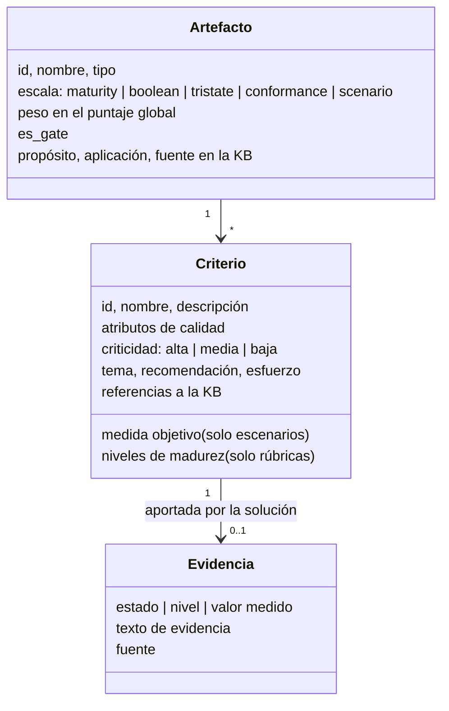
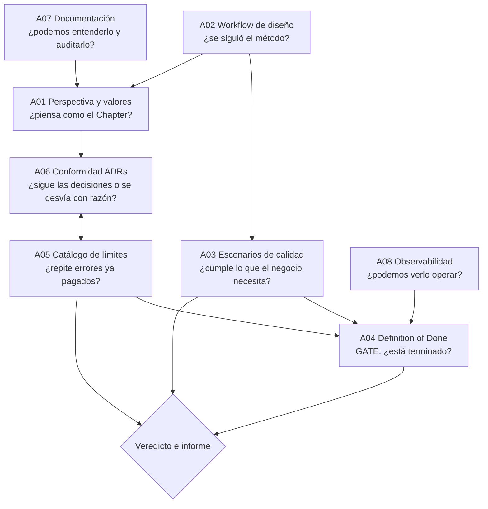

# Documentación de los Artefactos de Assessment

> **Fase 1 del reto.** Este documento describe cada artefacto de assessment que el Chapter de
> Arquitectura de Pragma pone a disposición para evaluar soluciones empresariales, su propósito,
> cómo se aplica, cómo se puntúa dentro del sistema de evaluación y cómo se relaciona con los
> demás. Los artefactos no se inventaron para este reto: se derivan de la base de conocimiento
> oficial del Chapter (`sopp-chapter-arquitectura-doc-md-kb`), cuyo contenido se referencia por
> ruta en cada criterio.

## 1. ¿Qué es un artefacto de assessment y para qué sirve?

Un artefacto de assessment es un **instrumento de evaluación reutilizable** que convierte el
conocimiento del Chapter (mentalidad, decisiones aprobadas, límites detectados en proyectos
reales, estándares y guías) en **criterios observables y puntuables**. Su propósito es hacer que
una evaluación de arquitectura sea:

- **Objetiva:** cada criterio exige evidencia y una fuente (repositorio, pipeline, tablero,
  incidente, entrevista), no una opinión.
- **Repetible:** dos evaluadores distintos, con la misma evidencia, llegan al mismo puntaje.
- **Trazable:** cada hallazgo apunta al documento del Chapter que lo respalda, de modo que la
  recomendación no es "una buena práctica" sino un lineamiento institucional.
- **Accionable:** cada criterio trae una recomendación, un esfuerzo estimado y un tema, con los
  que el sistema construye la hoja de ruta.

En el sistema de evaluación, los artefactos son **datos** (`data/artifacts/*.json`) y el motor es
**código** (`assessment_system/`). Esto permite que el Chapter agregue, versione o recalibre
artefactos sin modificar el sistema, en línea con su principio de que el conocimiento debe ser
"AI-Ready" y docs-as-code.

## 2. Origen: la base de conocimiento del Chapter

La KB del Chapter se organiza en cuatro tipos de conocimiento; cada tipo alimenta uno o más
artefactos:

| Tipo en la KB | Qué contiene | Artefacto(s) que alimenta |
|---|---|---|
| `perspective.md` | Propósito, mentalidad, valores de ingeniería, Dos y Don'ts | A01 Rúbrica de Perspectiva |
| `references/` | Procedimientos y estándares obligatorios (workflow de diseño, DoD, documentación, observabilidad) | A02, A04, A07, A08 |
| `decisions/` | 9 ADRs institucionales aprobados | A06 Conformidad con Decisiones |
| `limits/` | 10 restricciones innegociables aprendidas en proyectos reales, con señales de alerta | A05 Catálogo de Límites |
| `tools/templates/` | Plantillas de decisión, límite, referencia | Formato de los ADRs locales exigidos por A01 y A06 |

Los escenarios de calidad (A03) no están escritos en la KB porque dependen de cada solución;
el artefacto aporta la **plantilla y la exigencia** (Fase 1, paso 2 del workflow: "Quality
Attributes Workshop, escenarios medibles y SLOs") y el evaluador instancia los escenarios para el
dominio bajo evaluación.

## 3. Correspondencia con los tres artefactos del enunciado

El código base del reto nombraba tres artefactos genéricos. La tabla muestra cómo se concretan:

| Artefacto del enunciado | Propósito genérico | Artefactos concretos que lo materializan |
|---|---|---|
| Artefacto 1 — Arquitectura | Analizar estructura y componentes | A01 Perspectiva, A02 Workflow de diseño, A06 Conformidad ADRs, A07 Documentación C4; A04 DoD como gate transversal |
| Artefacto 2 — Escalabilidad | Capacidad de manejar cargas crecientes | A03 Escenarios de calidad (rendimiento, escalabilidad, disponibilidad), A05 Límites 004/005/008, A08 Observabilidad (métricas y FinOps) |
| Artefacto 3 — Seguridad | Medidas de seguridad implementadas | A04 DoD (secretos, SAST), A05 Límites 006/007, A03 Escenarios de autorización y auditabilidad, A08 (PII en logs) |

## 4. Modelo común de un artefacto

Todos los artefactos comparten la misma estructura, lo que permite aplicarlos con un único motor:

**Escalas de puntuación** (todas normalizan a 0..1 por criterio):

| Escala | Valores | Puntuación | Usada por |
|---|---|---|---|
| `maturity` | Nivel 0 a 4 | nivel / 4 | A01 |
| `boolean` | pass · partial · fail | 1 · 0.5 · 0 | A02, A04, A07, A08 |
| `tristate` | compliant · at-risk · violated | 1 · 0.5 · 0 | A05 |
| `conformance` | aligned · justified-deviation · partial · unjustified-deviation | 1 · 0.75 · 0.5 · 0 | A06 |
| `scenario` | valor medido vs objetivo | 1 si cumple; si no, crédito proporcional con tope 0.9 | A03 |

**Severidad de los hallazgos:** se deriva de la criticidad del criterio y de la puntuación:
criticidad alta con puntaje 0 es **Crítico**; alta con parcial o media con 0 es **Alto**; y así
hasta **Bajo**. La ausencia de evidencia también genera hallazgo: no aportar evidencia no
equivale a cumplir.

**Bloqueantes:** un límite del Chapter *violado* o una verificación de alta criticidad que falla
en un gate es bloqueante para producción, independientemente del puntaje global.

## 5. Los ocho artefactos

### A01 · Rúbrica de Perspectiva y Valores de Ingeniería

| | |
|---|---|
| **Fuente** | `kb/perspective.md` |
| **Tipo / escala** | Rúbrica · madurez 0-4 |
| **Peso** | 15% |
| **Propósito** | Medir la alineación de la arquitectura con la mentalidad del Chapter: el dominio dicta las reglas, todo es un trade-off, simplicidad y reversibilidad, validación automatizada, observabilidad y medibilidad. |
| **Criterios** | VAL-01 Evolutividad · VAL-02 Desacoplamiento y Bounded Contexts · VAL-03 Simplicidad esencial · VAL-04 Independencia tecnológica (hexagonal) · VAL-05 SLIs/SLOs · VAL-06 DDD y lenguaje ubicuo · VAL-07 ADRs y SAD · VAL-08 Deuda técnica visible |

**Cómo se aplica.** Cada valor tiene descripciones explícitas para los cinco niveles de madurez
(de "inexistente" a "medido y optimizado"). El evaluador revisa estructura de paquetes, diagramas,
ADRs, backlog y entrevista al equipo, y asigna el nivel cuya descripción mejor coincide con la
evidencia. Es el artefacto más cualitativo, por eso los niveles están redactados como hechos
observables (por ejemplo, "el cambio típico cruza más de dos servicios") y no como adjetivos.

**Errores comunes al aplicarlo.** Calificar la intención en vez de la evidencia ("el equipo
conoce DDD" no es nivel 3); promediar sin justificar el nivel; ignorar los Don'ts (framework-driven
design, balas de plata, big design up front) que son tan diagnósticos como los valores.

### A02 · Checklist del Flujo de Diseño Arquitectónico

| | |
|---|---|
| **Fuente** | `kb/references/v1/architectural-design-workflow.md` |
| **Tipo / escala** | Checklist · pass/partial/fail |
| **Peso** | 10% |
| **Propósito** | Verificar que la solución recorrió las tres fases del flujo del Chapter (descubrimiento y alto nivel; diseño detallado y habilitación; verificación continua) y que existen sus entregables. |
| **Criterios** | WF-01 Capacidades y lenguaje ubicuo · WF-02 ASRs con SLOs · WF-03 ADRs · WF-04 C4 y API-First · WF-05 Infra, IaC y DevSecOps · WF-06 Fitness functions y deuda |

**Cómo se aplica.** Es el checklist de verificación que el propio documento del Chapter incluye,
ampliado con el paso de infraestructura. Evalúa el **proceso**, no el resultado: una arquitectura
puede ser buena por accidente; este artefacto detecta si es buena por método y si podrá seguir
siéndolo.

**Relación con otros.** Es la "puerta de entrada": si WF-02 falla (no hay escenarios de calidad),
el artefacto A03 tendrá que construirlos durante la evaluación, como ocurrió en el caso de estudio.

### A03 · Escenarios de Atributos de Calidad (ASR / QAW)

| | |
|---|---|
| **Fuente** | Workflow de diseño, Fase 1 paso 2 (QAW y SLOs); plantilla de escenario de seis partes (fuente, estímulo, entorno, artefacto, respuesta, medida) |
| **Tipo / escala** | Escenarios · medido vs objetivo |
| **Peso** | 20% (el mayor: mide lo que el negocio siente) |
| **Propósito** | Convertir necesidades vagas ("que sea rápido", "que escale") en escenarios medibles y verificar con pruebas de carga, incidentes y ejercicios si la solución los cumple. |
| **Criterios** | QAS-01 Consulta con +50% usuarios · QAS-02 Valoración EOD de 250k portafolios · QAS-03 Disponibilidad 99,9% · QAS-04 Ingesta de 20k ticks/s · QAS-05 Degradación controlada · QAS-06 Autorización 100% · QAS-07 RPO/RTO · QAS-08 Nuevo tipo de activo · QAS-09 Auditabilidad de órdenes |

**Cómo se aplica.** Los escenarios se instancian para el dominio (aquí, gestión de portafolios) a
partir de las prioridades de calidad declaradas por el negocio. Cada escenario fija una medida
objetivo que se convierte en SLO. La medida observada proviene de K6/JMeter, métricas de producción
o postmortems. El sistema compara y da crédito parcial proporcional cuando no se cumple, para
distinguir "lejos del objetivo" de "casi".

**Errores comunes.** Escenarios sin medida ("debe ser escalable"); medir en un entorno distinto al
declarado; confundir el objetivo del negocio con la capacidad actual (fijar el SLO donde ya está
el sistema); olvidar atributos no funcionales de negocio como auditabilidad o modificabilidad.

### A04 · Definition of Done de Arquitectura y Calidad

| | |
|---|---|
| **Fuente** | `kb/references/v1/architecture-definition-of-done.md` |
| **Tipo / escala** | **Gate** · pass/partial/fail |
| **Peso** | 15% |
| **Propósito** | Punto de control innegociable: las 10 verificaciones que definen cuándo un incremento de arquitectura está "terminado" y listo para producción. |
| **Criterios** | DOD-01 Fitness functions · DOD-02 Cobertura ≥ 80% · DOD-03 Secretos · DOD-04 SAST limpio · DOD-05 Métricas DORA · DOD-06 Tolerancia a fallos y rendimiento · DOD-07 Deuda registrada · DOD-08 Trazabilidad · DOD-09 Code review · DOD-10 Contratos |

**Cómo se aplica.** A diferencia de los demás, este artefacto se evalúa como **gate**: además del
puntaje, se supera solo si las 10 verificaciones están en `pass`. Un fallo en una verificación de
criticidad alta (secretos, SAST, tolerancia a fallos) es bloqueante. La evidencia es
principalmente del pipeline (SonarQube, escáneres, cobertura) y del código.

**Relación con otros.** El DoD es el "resumen ejecutable" de la KB: su checklist exige
explícitamente "no existen violaciones contra la carpeta `limits/`", por lo que A04 y A05 se
refuerzan mutuamente.

### A05 · Catálogo de Límites y Anti-patrones

| | |
|---|---|
| **Fuente** | `kb/limits/v1/001` a `010` |
| **Tipo / escala** | Catálogo de riesgos · compliant/at-risk/violated |
| **Peso** | 15% |
| **Propósito** | Detectar las diez restricciones que el Chapter declara "terminantemente prohibidas" porque ya causaron incidentes en proyectos reales. |
| **Criterios** | LIM-001 Fallos en cascada · LIM-002 Base de datos compartida · LIM-003 Contratos frágiles · LIM-004 Hambre de recursos · LIM-005 Saturación de pools · LIM-006 Secretos en código · LIM-007 Sin mTLS · LIM-008 Sin backpressure · LIM-009 Ceguera operacional · LIM-010 Retry storms |

**Cómo se aplica.** Cada límite en la KB trae "contexto de identificación" y "señales de alerta";
el evaluador las usa como guía de inspección (métricas de lag, OOMKilled, errores 504, esquemas
compartidos, escaneo de secretos). `at-risk` significa que hay señales tempranas sin incidente;
`violated`, que la restricción se incumple. **Todo límite violado es bloqueante**, porque el
Chapter ya pagó ese costo antes.

**Errores comunes.** Marcar `compliant` por ausencia de incidentes (la ausencia de evidencia no
es evidencia de cumplimiento); evaluar solo el camino síncrono e ignorar consumidores y jobs;
tratar un límite como "recomendación".

### A06 · Conformidad con las Decisiones del Chapter (ADRs)

| | |
|---|---|
| **Fuente** | `kb/decisions/v1/001` a `009` |
| **Tipo / escala** | Conformidad · aligned / justified-deviation / partial / unjustified-deviation |
| **Peso** | 10% |
| **Propósito** | Verificar que la solución sigue las decisiones institucionales y, si se desvía, que lo hace de forma consciente y documentada. |
| **Criterios** | ADR-001 Asincronía · ADR-002 Database-per-service · ADR-003 Service Mesh · ADR-004 Caché · ADR-005 Protocolos · ADR-006 Persistencia políglota · ADR-007 Secretos · ADR-008 K8s vs Serverless · ADR-009 Observabilidad |

**Cómo se aplica.** La clave de este artefacto es que **una desviación justificada es
aceptable** (puntúa 0.75): el Chapter defiende que "todo es un trade-off" y que las decisiones deben
ser explícitas. Lo que penaliza es la desviación silenciosa. Por eso la evidencia incluye los ADRs
locales de la solución y su estado (aprobado, propuesto, sin fecha de salida).

**Relación con otros.** Cada límite en A05 enlaza a la decisión que lo previene; cuando un límite
está violado, casi siempre hay una decisión no seguida en A06 (por ejemplo LIM-002 y ADR-002).
El sistema muestra ambos porque responden a preguntas distintas: "¿hay riesgo?" y "¿hay gobierno?".

### A07 · Estándar de Documentación y Diagramación (C4 / Docs-as-Code)

| | |
|---|---|
| **Fuente** | `kb/references/v1/documentation-and-diagramming-standard.md` |
| **Tipo / escala** | Checklist · pass/partial/fail |
| **Peso** | 5% |
| **Propósito** | Comprobar que la arquitectura está documentada de forma legible por humanos y por agentes de IA: C4 con niveles bien delimitados, Mermaid versionado junto al código, contratos OpenAPI/AsyncAPI con SemVer. |
| **Criterios** | DOC-01 Contexto sin tecnología · DOC-02 Contenedores con tecnología y protocolo · DOC-03 Diagramas como código · DOC-04 Contratos versionados |

**Cómo se aplica.** Se revisan el SAD, los README y el catálogo de contratos contra el checklist
del estándar. Tiene el peso más bajo porque la documentación no hace mejor al sistema en
producción, pero es precondición para que la evaluación misma sea posible y para que la IA
corporativa pueda auditar la arquitectura.

### A08 · Guía de Implementación de Observabilidad

| | |
|---|---|
| **Fuente** | `kb/references/v1/observability-implementation-guide.md` |
| **Tipo / escala** | Checklist · pass/partial/fail |
| **Peso** | 10% |
| **Propósito** | Verificar que la solución no sufre "ceguera operacional": trazas extremo a extremo, logs JSON sin datos sensibles, métricas técnicas y de negocio, alertas con control de anomalías y de presupuesto. |
| **Criterios** | OBS-01 traceId íntegro · OBS-02 Logs JSON sin PII centralizados · OBS-03 Métricas RED/USE y KPIs · OBS-04 Alertas de anomalías y FinOps |

**Cómo se aplica.** Se revisan configuración de instrumentación, muestras reales de logs, tableros
y reglas de alerta. OBS-02 tiene criticidad alta porque además de observabilidad toca protección
de datos: un log con número de cuenta es un hallazgo de seguridad y cumplimiento, no solo de
operación.

## 6. Cómo se relacionan los artefactos entre sí

Lectura del grafo:

1. **A02 y A07** evalúan si existe el insumo para evaluar: método y documentación. Sin ellos, los
   demás artefactos trabajan con evidencia pobre y lo señalan como hallazgo.
2. **A01 y A06** evalúan gobierno: cómo piensa el equipo y si sus decisiones dialogan con las del
   Chapter.
3. **A03, A05 y A08** evalúan el comportamiento real: qué mide el negocio, qué riesgos técnicos
   conocidos están presentes y si el sistema es observable.
4. **A04** consolida como gate: recoge los mínimos de todos los anteriores y decide si el
   incremento está "terminado".
5. El **veredicto** combina el puntaje ponderado, el resultado del gate y los bloqueantes.
   Un puntaje alto con un límite violado sigue siendo "no apto": la agregación no puede esconder
   una restricción innegociable.

## 7. Decisiones de diseño del sistema de evaluación

- **Pesos.** A03 pesa 20% porque mide el impacto en el negocio; A04 y A05 15% cada uno porque son
  los mínimos innegociables; A01 15% porque la mentalidad predice la evolución; A02, A06 y A08 10%;
  A07 5%. Los pesos son datos y el sistema valida que sumen 1.0.
- **Crédito parcial en escenarios con tope 0.9.** Evita que un escenario incumplido por poco
  parezca cumplido, pero distingue "41 minutos contra 30" de "3 horas contra 30".
- **La ausencia de evidencia es un hallazgo.** El sistema penaliza con puntaje 0 y severidad
  Medio/Alto; una evaluación que no consigue evidencia debe decirlo.
- **Bloqueantes por encima del promedio.** El veredicto se decide primero por límites violados y
  hallazgos críticos, y solo después por el puntaje.
- **Recomendaciones agrupadas por tema.** Tres artefactos pueden señalar el mismo problema
  (secretos en DOD-03, LIM-006 y ADR-007); la hoja de ruta los consolida en una acción por tema con
  el horizonte de la severidad máxima.

## 8. Referencias

- Base de conocimiento del Chapter de Arquitectura: `somospragma/sopp-chapter-arquitectura-doc-md-kb`
  (`kb/perspective.md`, `kb/decisions/v1/`, `kb/limits/v1/`, `kb/references/v1/`, `tools/templates/kb/`).
- Bass, Clements, Kazman. *Software Architecture in Practice* — plantilla de escenarios de calidad
  y método ADD, referenciados por el workflow del Chapter.
- Ford, Parsons, Kua. *Building Evolutionary Architectures* — fitness functions, exigidas por el
  DoD del Chapter.
- Modelo C4 (Simon Brown) — base del estándar de documentación del Chapter.
