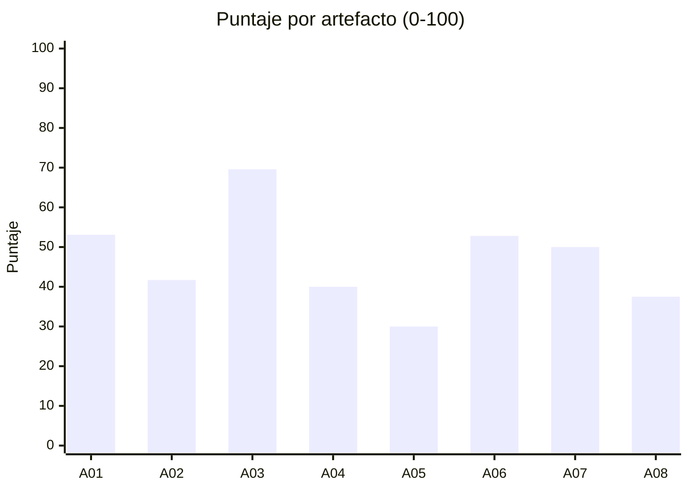

# Informe de Evaluación de Arquitectura — InvestCore — Plataforma de Gestión de Portafolio de Inversiones

| Campo | Valor |
|---|---|
| **Solución evaluada** | InvestCore — Plataforma de Gestión de Portafolio de Inversiones (v2026.08 (release 14)) |
| **Cliente / Dominio** | Fiduciaria Andina (caso de estudio) · Gestión de portafolios de inversión: administración de portafolios, ejecución de órdenes, valoración, riesgo y cumplimiento, y reportería a clientes |
| **Fecha de evaluación** | 2026-09-08T15:03 -05 |
| **Marco de referencia** | Artefactos de assessment del Chapter de Arquitectura de Pragma |
| **Artefactos aplicados** | 8 artefactos · 60 criterios |

## 1. Resumen ejecutivo

**Puntaje global: 48.1 / 100 — Nivel 2 - Gestionado.**

**Veredicto: NO APTO para nuevas liberaciones críticas sin plan de remediación.** 8 hallazgo(s) críticos y 6 bloqueante(s) violan límites innegociables del Chapter.

InvestCore administra 250.000 portafolios de personas naturales y fondos de inversión colectiva. Expone canales web y móvil para inversionistas y asesores, ejecuta órdenes contra brokers y custodios, valora los portafolios con precios de mercado en tiempo real y al cierre, controla límites de riesgo y genera extractos regulatorios. Está construida como siete microservicios Java (Spring Boot, arquitectura hexagonal en la mayoría) sobre AWS EKS, con Kafka (MSK) para eventos, PostgreSQL, MongoDB y Redis como persistencia, y una capa anticorrupción hacia el core contable heredado.

| Severidad | Hallazgos |
|---|---:|
| 🔴 Crítico | 8 |
| 🟠 Alto | 16 |
| 🟡 Medio | 25 |
| 🟢 Bajo | 4 |
| ⛔ Bloqueantes para producción | 6 |

### Los cinco riesgos que requieren decisión inmediata

1. **🔴 No cumple: Seguridad y gestión de secretos (DevSecOps)** — API key del proveedor de datos de mercado y credenciales SMTP en application.yml versionado en pricing-service y reporting-service; el resto de secretos está en AWS Secrets Manager. No hay escaneo de secretos en el pipeline. (Estado declarado: fail)
   - *Acción:* Rotar las credenciales expuestas, migrarlas a AWS Secrets Manager e integrar gitleaks/trufflehog como gate bloqueante del pipeline.
2. **🔴 No cumple: Fallos en cascada por timeouts y falta de Circuit Breaker** — pricing-service invoca al proveedor de precios sin timeout ni circuit breaker; el incidente INC-2026-071 produjo 504 en cascada hacia portfolio-service y el BFF. (Estado declarado: violated)
   - *Acción:* Configurar timeouts agresivos y Circuit Breaker con fallback en todos los clientes salientes; aislar pools con Bulkheads.
3. **🔴 No cumple: Monolito distribuido por base de datos compartida** — reporting-service lee las tablas 'positions' y 'portfolios' del esquema de portfolio-service; una migración de columna en julio rompió la generación de extractos. (Estado declarado: violated)
   - *Acción:* Separar el esquema de reportería con una proyección propia alimentada por eventos (CQRS) y retirar el acceso directo entre servicios.
4. **🔴 No cumple: Brechas de seguridad por secretos en código** — API key del proveedor de datos de mercado y credenciales SMTP versionadas en application.yml; el historial del repositorio conserva una contraseña de base de datos rotada en 2025. (Estado declarado: violated)
   - *Acción:* Rotar y migrar los secretos a Secrets Manager con inyección en tiempo de ejecución; escanear el historial del repositorio y bloquear nuevos secretos en el pipeline.
5. **🔴 No cumple: Falta de backpressure** — El consumidor de valoración procesa sin control de lag ni límite de concurrencia; en la apertura del 29/08 la cola creció hasta agotar memoria (OOM). No hay respuestas 429 en las APIs internas. (Estado declarado: violated)
   - *Acción:* Implementar rate limiting en el borde, control de lag en consumidores Kafka y buffers elásticos con DLQ para la valoración.

## 2. Alcance y metodología

La evaluación aplica de forma sistemática los artefactos de assessment del Chapter de Arquitectura. Cada artefacto declara *qué* se mide (criterios, escala y criticidad); el sistema de evaluación aporta *cómo* se mide (puntuación normalizada, severidad, gates y agregación ponderada). La evidencia proviene de repositorios, pipelines, tableros de observabilidad, documentación y entrevistas con el equipo.

| Artefacto | Tipo | Escala | Peso | Dimensión original |
|---|---|---|---:|---|
| A01 · Rúbrica de Perspectiva y Valores de Ingeniería | rubric | maturity | 15% | Artefacto 1 — Arquitectura |
| A02 · Checklist del Flujo de Diseño Arquitectónico | checklist | boolean | 10% | Artefacto 1 — Arquitectura |
| A03 · Escenarios de Atributos de Calidad (ASR / QAW) | scenarios | scenario | 20% | Artefacto 2 — Escalabilidad (y demás atributos medibles) |
| A04 · Definition of Done de Arquitectura y Calidad | gate | boolean | 15% | Artefacto 1 y 3 — Arquitectura y Seguridad (quality gate transversal) |
| A05 · Catálogo de Límites y Anti-patrones | risk-catalog | tristate | 15% | Artefacto 2 y 3 — Escalabilidad y Seguridad (riesgos técnicos) |
| A06 · Conformidad con las Decisiones del Chapter (ADRs) | conformance | conformance | 10% | Artefacto 1 — Arquitectura (alineación institucional) |
| A07 · Estándar de Documentación y Diagramación (C4 / Docs-as-Code) | checklist | boolean | 5% | Artefacto 1 — Arquitectura (comunicación del diseño) |
| A08 · Guía de Implementación de Observabilidad | checklist | boolean | 10% | Artefacto 2 y 3 — Escalabilidad y Seguridad (operación y protección de datos) |

**Escala de madurez global:** Nivel 1 Inicial (< 30) · Nivel 2 Gestionado (30-49) · Nivel 3 Definido (50-69) · Nivel 4 Medido (70-84) · Nivel 5 Optimizado (≥ 85).

**Prioridades de calidad declaradas por el negocio:** seguridad, disponibilidad, rendimiento, escalabilidad, cumplimiento, mantenibilidad.

## 3. Resultados por artefacto

| Artefacto | Puntaje | Cumple | Parcial | No cumple | Sin evidencia | Gate |
|---|---:|---:|---:|---:|---:|---|
| A01 · Rúbrica de Perspectiva y Valores de Ingeniería | 🟧 53.1 | 0 | 8 | 0 | 0 | — |
| A02 · Checklist del Flujo de Diseño Arquitectónico | 🟧 41.7 | 0 | 5 | 1 | 0 | — |
| A03 · Escenarios de Atributos de Calidad (ASR / QAW) | 🟨 69.6 | 1 | 8 | 0 | 0 | — |
| A04 · Definition of Done de Arquitectura y Calidad | 🟧 40.0 | 1 | 6 | 3 | 0 | ❌ No superado |
| A05 · Catálogo de Límites y Anti-patrones | 🟥 30.0 | 1 | 4 | 5 | 0 | — |
| A06 · Conformidad con las Decisiones del Chapter (ADRs) | 🟧 52.8 | 3 | 3 | 3 | 0 | — |
| A07 · Estándar de Documentación y Diagramación (C4 / Docs-as-Code) | 🟧 50.0 | 1 | 2 | 1 | 0 | — |
| A08 · Guía de Implementación de Observabilidad | 🟥 37.5 | 0 | 3 | 1 | 0 | — |

## 4. Mapa de calor por atributo de calidad

| Atributo de calidad | Puntaje | Lectura |
|---|---:|---|
| evolutividad | 🟥 26.4 | Debilidad crítica |
| operabilidad | 🟥 33.3 | Debilidad crítica |
| resiliencia | 🟥 35.1 | Debilidad crítica |
| cumplimiento | 🟥 37.5 | Debilidad crítica |
| disponibilidad | 🟥 37.5 | Debilidad crítica |
| seguridad | 🟥 39.0 | Debilidad crítica |
| gobierno | 🟧 40.0 | Debilidad relevante |
| finops | 🟧 41.7 | Debilidad relevante |
| mantenibilidad | 🟧 45.0 | Debilidad relevante |
| escalabilidad | 🟧 47.4 | Debilidad relevante |
| confiabilidad | 🟧 50.0 | Debilidad relevante |
| observabilidad | 🟧 50.0 | Debilidad relevante |
| portabilidad | 🟧 50.0 | Debilidad relevante |
| alineación con negocio | 🟨 62.5 | Aceptable con mejoras |
| continuidad | 🟨 66.7 | Aceptable con mejoras |
| interoperabilidad | 🟨 70.0 | Aceptable con mejoras |
| rendimiento | 🟨 71.1 | Aceptable con mejoras |

## 5. Hallazgos

### 🔴 Crítico (8)

| ID | Hallazgo | Artefacto | Evidencia | Bloqueante |
|---|---|---|---|---|
| H-DOD-03 | No cumple: Seguridad y gestión de secretos (DevSecOps) | A04 | API key del proveedor de datos de mercado y credenciales SMTP en application.yml versionado en pricing-service y reporting-service; el resto de secretos está en AWS Secrets Manager. No hay escaneo de secretos en el pipeline. (Estado declarado: fail) | ⛔ Sí |
| H-LIM-001 | No cumple: Fallos en cascada por timeouts y falta de Circuit Breaker | A05 | pricing-service invoca al proveedor de precios sin timeout ni circuit breaker; el incidente INC-2026-071 produjo 504 en cascada hacia portfolio-service y el BFF. (Estado declarado: violated) | ⛔ Sí |
| H-LIM-002 | No cumple: Monolito distribuido por base de datos compartida | A05 | reporting-service lee las tablas 'positions' y 'portfolios' del esquema de portfolio-service; una migración de columna en julio rompió la generación de extractos. (Estado declarado: violated) | ⛔ Sí |
| H-LIM-006 | No cumple: Brechas de seguridad por secretos en código | A05 | API key del proveedor de datos de mercado y credenciales SMTP versionadas en application.yml; el historial del repositorio conserva una contraseña de base de datos rotada en 2025. (Estado declarado: violated) | ⛔ Sí |
| H-LIM-008 | No cumple: Falta de backpressure | A05 | El consumidor de valoración procesa sin control de lag ni límite de concurrencia; en la apertura del 29/08 la cola creció hasta agotar memoria (OOM). No hay respuestas 429 en las APIs internas. (Estado declarado: violated) | ⛔ Sí |
| H-LIM-010 | No cumple: Reintentos sin control (Retry Storm) | A05 | El adaptador de ingesta de precios reintenta 3 veces de forma inmediata y sin backoff ante error del proveedor; durante INC-2026-071 el tráfico hacia el proveedor se triplicó. (Estado declarado: violated) | ⛔ Sí |
| H-ADR-002 | No cumple: Uso de bases NoSQL y Database-per-service | A06 | El esquema compartido entre portfolio-service y reporting-service contradice Database-per-service; el ADR-INV-09 que lo justifica como temporal está sin aprobar y sin fecha de salida. (Estado declarado: unjustified-deviation) | No |
| H-ADR-007 | No cumple: Gobierno de secretos con Secret Manager / Vault | A06 | Uso mixto: la mayoría de secretos en Secrets Manager pero credenciales críticas en archivos versionados; sin rotación automática. (Estado declarado: unjustified-deviation) | No |

### 🟠 Alto (16)

| ID | Hallazgo | Artefacto | Evidencia | Bloqueante |
|---|---|---|---|---|
| H-ADR-003 | No cumple: Adopción de Service Mesh en ecosistemas críticos | A06 | Siete microservicios críticos financieros sin service mesh ni alternativa de mTLS; no existe ADR local que documente la decisión de no adoptarlo. (Estado declarado: unjustified-deviation) | No |
| H-DOD-01 | No cumple: Validación continua (fitness functions) | A04 | Sin pruebas de arquitectura automatizadas; la regla de dependencias hexagonal se verifica solo en code review. (Estado declarado: fail) | No |
| H-DOD-04 | Parcial: Análisis estático (SAST) limpio | A04 | SonarQube reporta 3 vulnerabilidades altas abiertas (dependencias) y el gate no es bloqueante; no se escanean imágenes (Trivy) ni IaC (Checkov). (Estado declarado: partial) | No |
| H-DOD-06 | Parcial: Tolerancia a fallos y rendimiento | A04 | Circuit Breaker y timeouts solo en el BFF; los clientes hacia datos de mercado, custodio y core no tienen timeout explícito. Pruebas K6 existen pero se ejecutan manualmente. (Estado declarado: partial) | No |
| H-DOD-07 | No cumple: Gestión transparente de la deuda técnica | A04 | La deuda se registra en Confluence, fuera del backlog, sin impacto económico ni interés. (Estado declarado: fail) | No |
| H-LIM-007 | Parcial: Falta de validación de identidad (sin mTLS) | A05 | TLS termina en el ingress; el tráfico interno entre pods es HTTP plano. Existen NetworkPolicies por namespace pero no autenticación mutua ni identidad de servicio. (Estado declarado: at-risk) | No |
| H-OBS-02 | Parcial: Logs 100% JSON, sin PII ni datos bancarios, centralizados | A08 | Logs centralizados en CloudWatch; 4 de 7 servicios en JSON. reporting-service registra número de cuenta y documento de identidad del cliente en texto plano al generar extractos. (Estado declarado: partial) | No |
| H-OBS-04 | No cumple: Alertas de anomalías y topes de presupuesto (FinOps) | A08 | Alertas basadas en umbrales estáticos sin detección de anomalías; sin AWS Budgets ni alertas de costo; las alertas llegan a Slack sin throttling ni integración con tickets. (Estado declarado: fail) | No |
| H-QAS-01 | Parcial: Consulta de portafolio con 50% más usuarios concurrentes | A03 | Prueba K6 con 4.500 VUs: p95 = 2.650 ms y 0,8% de errores; la valoración se calcula en línea llamando a pricing-service por cada posición. (Medido: 2650 ms · Objetivo: <= 2000 ms) | No |
| H-QAS-02 | Parcial: Valoración de fin de día de 250.000 portafolios | A03 | La valoración de fin de día tomó 41 minutos en promedio en agosto (máximo 53 min el 29/08), con un solo consumidor por partición y 6 particiones. (Medido: 41 min · Objetivo: <= 30 min) | No |
| H-QAS-03 | Parcial: Disponibilidad en horario de mercado | A03 | Disponibilidad de 99,87% en los últimos 3 meses; dos incidentes mayores: caída del proveedor de precios (90 min degradados) y OOM del batch que afectó a la API de valoración. (Medido: 99.87 % · Objetivo: >= 99.9 %) | No |
| H-QAS-05 | Parcial: Degradación controlada ante caída del proveedor de precios | A03 | Durante INC-2026-071 el proveedor de precios respondió con latencia > 30 s; pricing-service no tiene timeout ni circuit breaker y los clientes recibieron 504 durante 90 s hasta la intervención manual (solo el BFF tiene Resilience4j). (Medido: 90 s · Objetivo: <= 5 s) | No |
| H-QAS-06 | Parcial: Autorización completa sobre datos de portafolio | A03 | 48 de 50 endpoints que exponen datos de portafolio o cliente aplican autorización; 2 endpoints internos de reporting-service (/internal/positions, /internal/statements) solo validan red y no identidad. (Medido: 96 % · Objetivo: >= 100 %) | No |
| H-VAL-02 | Parcial: Desacoplamiento y alta cohesión (Bounded Contexts) | A01 | Los contextos están separados en servicios, pero reporting-service lee directamente las tablas de portfolio-service y risk-compliance consulta customer-service de forma síncrona en cada evaluación. (Nivel 1/4 — Servicios separados pero con acoplamiento por base de datos y llamadas cruzadas.) | No |
| H-WF-02 | Parcial: Atributos de calidad (ASRs) con métricas y SLOs | A02 | Los requisitos no funcionales existen como lista textual ('alta disponibilidad', 'respuesta rápida') sin escenarios estímulo-respuesta ni SLOs formales; los escenarios de este assessment se construyeron durante la evaluación. (Estado declarado: partial) | No |
| H-WF-06 | No cumple: Verificación continua: fitness functions y deuda en el backlog | A02 | No existen fitness functions (sin ArchUnit ni reglas de dependencia automatizadas); la deuda no se gestiona en sprints. (Estado declarado: fail) | No |

### 🟡 Medio (25)

| ID | Hallazgo | Artefacto | Evidencia | Bloqueante |
|---|---|---|---|---|
| H-ADR-006 | Parcial: Persistencia políglota por Bounded Context | A06 | PostgreSQL para portafolio y órdenes, MongoDB para riesgo/cumplimiento y Redis para precios, alineado con la estrategia políglota; sin embargo el aislamiento por contexto se rompe en reporting-service. (Estado declarado: partial) | No |
| H-ADR-009 | Parcial: Observabilidad de pila completa | A06 | OpenTelemetry y logs JSON en 4 de 7 servicios; el batch y reporting-service quedan fuera de la trazabilidad distribuida. (Estado declarado: partial) | No |
| H-DOC-03 | No cumple: Diagramas como código (Mermaid en Markdown) | A07 | Los diagramas están en draw.io exportados a PNG en Confluence; existen tres versiones distintas del diagrama de contenedores. (Estado declarado: fail) | No |
| H-DOC-04 | Parcial: Contratos OpenAPI / AsyncAPI versionados (SemVer) | A07 | OpenAPI 3.0 versionado para todas las APIs REST; los 9 tópicos Kafka no tienen especificación AsyncAPI y los esquemas Avro no siguen SemVer. (Estado declarado: partial) | No |
| H-DOD-02 | Parcial: Cobertura mínima de pruebas del 80% | A04 | Cobertura global 62% (valuation-service 48%, order-service 81%, reporting-service 39%); el umbral no bloquea el pipeline. (Estado declarado: partial) | No |
| H-DOD-08 | Parcial: Trazabilidad de observabilidad | A04 | 4 de 7 servicios emiten logs JSON con traceId; valuation-batch y reporting-service emiten texto plano; health checks presentes en todos. (Estado declarado: partial) | No |
| H-DOD-10 | Parcial: Contratos e interoperabilidad estricta | A04 | APIs versionadas (/v1) con pruebas de contrato Pact entre BFF y servicios; el Swagger publicado de reporting-service y customer-service no coincide con el código (drift detectado en 6 endpoints). (Estado declarado: partial) | No |
| H-LIM-004 | Parcial: Hambre de recursos (Resource Exhaustion) | A05 | 5 de 7 despliegues definen requests/limits; valuation-batch y legacy-acl no los definen y el batch fue OOMKilled el 29/08 afectando el nodo. No hay alertas de anomalía de costos. (Estado declarado: at-risk) | No |
| H-LIM-005 | Parcial: Saturación de pools de conexión | A05 | HikariCP con tamaño por defecto (10) en valuation-service; en el cierre de mercado se observan esperas de conexión > 5 s y advertencias 'connection is not available'. (Estado declarado: at-risk) | No |
| H-LIM-009 | Parcial: Logging insuficiente (ceguera operacional) | A05 | Logs centralizados en CloudWatch, pero valuation-batch y reporting-service emiten texto plano sin traceId, lo que impidió correlacionar el incidente INC-2026-088 en menos de 2 horas. (Estado declarado: at-risk) | No |
| H-OBS-01 | Parcial: correlationId / traceId íntegro de extremo a extremo | A08 | El traceId se propaga desde el BFF por los servicios REST y gRPC, pero se pierde en las cabeceras Kafka y no existe en valuation-batch. (Estado declarado: partial) | No |
| H-OBS-03 | Parcial: Métricas RED/USE y KPIs de negocio en tableros | A08 | Métricas RED por servicio y USE de nodos en Grafana; no hay KPIs de negocio (portafolios valorados por minuto, órdenes ejecutadas, valor administrado). (Estado declarado: partial) | No |
| H-QAS-04 | Parcial: Ingesta sostenida de precios de mercado | A03 | En la prueba de ingesta el lag del tópico 'market.prices' crece a partir de 14.000 ticks/s; el consumidor no aplica backpressure y los reintentos del adaptador de ingesta son inmediatos. (Medido: 14000 ticks/s · Objetivo: >= 20000 ticks/s) | No |
| H-QAS-07 | Parcial: Recuperación ante desastre (RPO/RTO) | A03 | Snapshots de RDS cada hora (RPO efectivo 60 min) y runbook manual de conmutación ejecutado en 45 min en el ejercicio de DR de junio 2026. (Medido: 45 min · Objetivo: <= 30 min) | No |
| H-QAS-08 | Parcial: Modificabilidad: incorporar un nuevo tipo de activo | A03 | La incorporación de notas estructuradas tomó 18 días-persona y modificó 4 servicios (valuation, portfolio, reporting, order). (Medido: 18 días-persona · Objetivo: <= 10 días-persona) | No |
| H-VAL-01 | Parcial: Evolutividad y agilidad arquitectónica | A01 | La última incorporación de un instrumento (nota estructurada) tocó 4 servicios y tomó 18 días-persona; existe abstracción 'Instrument' pero la valoración por tipo está codificada con condicionales en valuation-service. (Nivel 2/4 — Existen algunos puntos de extensión pero el cambio típico cruza más de dos servicios.) | No |
| H-VAL-04 | Parcial: Independencia tecnológica (Clean / Hexagonal) | A01 | 5 de 7 servicios siguen el arquetipo hexagonal del Chapter; reporting-service y legacy-acl mezclan lógica de negocio en controladores y repositorios JPA. (Nivel 2/4 — La mayoría de servicios aplica puertos y adaptadores; hay excepciones.) | No |
| H-VAL-05 | Parcial: Observabilidad y medibilidad (SLIs / SLOs) | A01 | Existen métricas RED en Grafana y un objetivo informal de p95 < 2 s; no hay SLOs formales ni presupuesto de error por capacidad de negocio. (Nivel 2/4 — Métricas técnicas con algunos objetivos informales.) | No |
| H-VAL-06 | Parcial: El dominio dicta las reglas (DDD y lenguaje ubicuo) | A01 | Glosario ubicuo publicado (Portafolio, Posición, Orden, Ejecución, Valoración, Instrumento); los eventos Kafka y las APIs usan esos términos. Falta cubrir el contexto de cumplimiento. (Nivel 3/4 — Lenguaje ubicuo documentado y reflejado en código, eventos y APIs.) | No |
| H-VAL-07 | Parcial: Decisiones formales con trade-offs explícitos (ADRs y SAD) | A01 | Existen 5 ADRs locales con plantilla propia (sin sección de trade-offs económicos); decisiones como la ausencia de mesh o el esquema compartido no tienen ADR aprobado. El SAD está desactualizado (v2025.11). (Nivel 2/4 — ADRs para algunas decisiones; sin trade-offs explícitos.) | No |
| H-VAL-08 | Parcial: Gestión activa y visible de la deuda técnica | A01 | La deuda técnica está inventariada en una página de Confluence (23 ítems) sin estimación de impacto ni capacidad reservada; no se miden métricas DORA completas. (Nivel 2/4 — Deuda documentada fuera del backlog, sin priorización ni capacidad asignada.) | No |
| H-WF-01 | Parcial: Capacidades de negocio y lenguaje ubicuo documentados | A02 | Se realizó Event Storming en 2024 para portafolio, órdenes y valoración; los contextos de riesgo/cumplimiento y cliente se modelaron sin taller y sin mapa de capacidades actualizado. (Estado declarado: partial) | No |
| H-WF-03 | Parcial: ADRs explícitos para las decisiones clave | A02 | Hay ADRs para estilo (microservicios), eventos (Kafka), caché y despliegue del batch; no hay ADR para persistencia por servicio, seguridad interna ni observabilidad. (Estado declarado: partial) | No |
| H-WF-04 | Parcial: Vistas C4 estandarizadas y contratos API-First | A02 | Vistas C4 L1 y L2 existentes; sin vista de componentes para valuation-service y order-service. Contratos OpenAPI definidos antes de implementar; los eventos Kafka no tienen contrato formal. (Estado declarado: partial) | No |
| H-WF-05 | Parcial: Diseño de infraestructura y DevSecOps (IaC, topología, quality gates) | A02 | IaC con Terraform para EKS, RDS y MSK; Redis y reglas de WAF configurados manualmente. El pipeline ejecuta SonarQube pero el quality gate no bloquea el despliegue. (Estado declarado: partial) | No |

### 🟢 Bajo (4)

| ID | Hallazgo | Artefacto | Evidencia | Bloqueante |
|---|---|---|---|---|
| H-ADR-008 | Parcial: Elección de arquitectura de despliegue (Kubernetes vs Serverless) | A06 | El batch de valoración (carga intermitente) corre en EKS y no en Serverless; el ADR-INV-07 justifica la desviación por duración > 15 min y warm-up de JVM, con trade-offs documentados. (Estado declarado: justified-deviation) | No |
| H-DOC-02 | Parcial: Contenedores (C4 L2) con tecnología y protocolo | A07 | La vista de contenedores indica tecnologías pero omite el broker Kafka, el job batch y los protocolos de varias relaciones. (Estado declarado: partial) | No |
| H-DOD-05 | Parcial: Métricas DORA y observabilidad de CI/CD | A04 | Se mide Deployment Frequency (3/semana) y Lead Time; MTTR y Change Failure Rate no se capturan. (Estado declarado: partial) | No |
| H-VAL-03 | Parcial: Simplicidad esencial | A01 | Inventario de componentes justificado; se detectó un servicio 'notification-orchestrator' sin uso desde 2025 que ya está marcado para retiro. (Nivel 3/4 — Cada componente tiene una razón de negocio documentada.) | No |

## 6. Recomendaciones y hoja de ruta

Las recomendaciones se agrupan por tema y se ubican en un horizonte según la severidad máxima de los hallazgos que las originan. Cada acción está trazada a los criterios que la motivan y a la referencia del Chapter que la respalda.

### Horizonte 0-30 días

**🔴 Resiliencia** (esfuerzo medio; criterios DOD-06, LIM-001, LIM-010, QAS-03, QAS-05)
- Configurar timeouts agresivos y Circuit Breaker con fallback en todos los clientes salientes; aislar pools con Bulkheads.
- Configurar reintentos con backoff exponencial y jitter, límite de intentos y Circuit Breaker; derivar reprocesos a colas con DLQ.
- Extender Circuit Breaker y timeouts a todos los clientes salientes (datos de mercado, custodio, core) y automatizar las pruebas de carga en el pipeline de pre-producción.
- Eliminar los puntos únicos de falla identificados (broker en una zona, batch acoplado a la API) y adoptar despliegues progresivos (canary) con rollback automático.
- Implementar Circuit Breaker con timeout explícito y fallback de último precio conocido en el adaptador de datos de mercado (Resilience4j), con prueba de caos que valide el escenario.

**🔴 Datos y acoplamiento** (esfuerzo alto; criterios ADR-002, ADR-006, LIM-002, VAL-02)
- Separar el esquema de reportería con una proyección propia alimentada por eventos (CQRS) y retirar el acceso directo entre servicios.
- Registrar un ADR local que fije el plan de separación del esquema compartido y ejecutarlo mediante proyecciones por eventos.
- Formalizar el mapa de contextos (Context Map) con relaciones explícitas y eliminar el acceso directo a datos de otros contextos mediante APIs o eventos.
- Documentar la estrategia de consistencia eventual entre motores y las responsabilidades de respaldo por motor.

**🔴 Rendimiento y escalabilidad** (esfuerzo alto; criterios LIM-008, QAS-01, QAS-02, QAS-04)
- Implementar rate limiting en el borde, control de lag en consumidores Kafka y buffers elásticos con DLQ para la valoración.
- Introducir vista materializada de posiciones (CQRS) alimentada por eventos de valoración y ampliar la caché de precios, en lugar de calcular la valoración en línea por cada consulta.
- Particionar la valoración por segmento de portafolio y paralelizar consumidores con control de lag; evaluar Serverless o Jobs efímeros con límites de recursos.
- Aumentar particiones del tópico de precios, escalar consumidores con autoscaling por lag y aplicar backpressure en el adaptador de ingesta.

**🔴 Gestión de secretos** (esfuerzo bajo; criterios ADR-007, DOD-03, LIM-006)
- Rotar las credenciales expuestas, migrarlas a AWS Secrets Manager e integrar gitleaks/trufflehog como gate bloqueante del pipeline.
- Rotar y migrar los secretos a Secrets Manager con inyección en tiempo de ejecución; escanear el historial del repositorio y bloquear nuevos secretos en el pipeline.
- Completar la migración de todos los secretos a Secrets Manager con rotación automática y eliminar los valores en archivos de configuración.

### Horizonte 30-90 días

**🟠 Gobierno arquitectónico** (esfuerzo medio; criterios DOD-05, DOD-07, VAL-06, VAL-07, VAL-08, WF-01, WF-02, WF-03)
- Migrar el inventario de deuda a ítems del backlog con impacto e interés, y revisarlos en la planeación de cada release.
- Formalizar los escenarios de calidad con la plantilla estímulo-respuesta-medida y convertirlos en SLOs monitoreados.
- Ejecutar sesiones de Event Storming con negocio, publicar el glosario ubicuo y alinear nombres de agregados, eventos y APIs con ese glosario.
- Adoptar la plantilla de decisión del Chapter, completar los ADRs faltantes para decisiones ya tomadas y consolidar el SAD como documento vivo.
- Crear el registro de deuda técnica en el backlog con impacto económico e interés, reservar capacidad por sprint para su pago y publicar métricas DORA.
- Realizar Event Storming por contexto faltante y publicar el mapa de capacidades y el glosario en el repositorio de documentación.
- Completar los ADRs faltantes usando la plantilla del Chapter y vincularlos desde el SAD.
- Instrumentar el pipeline para capturar las cuatro métricas DORA y publicarlas en el tablero de ingeniería.

**🟠 Capacidad y finops** (esfuerzo bajo; criterios ADR-008, LIM-004, LIM-005, OBS-04)
- Activar CloudWatch Anomaly Detection y AWS Budgets con alertas al canal de guardia e integración con el sistema de tickets.
- Definir requests/limits para todos los despliegues vía IaC y bloquear en el pipeline los manifiestos sin cuotas; activar alertas de anomalía de costos.
- Dimensionar el pool según la concurrencia real, aplicar timeouts de adquisición y desviar lecturas calientes a caché.
- Revisar anualmente la decisión local sobre el batch de valoración conforme evolucionen los límites de ejecución Serverless.

**🟠 Calidad y validación continua** (esfuerzo medio; criterios DOD-01, DOD-02, WF-06)
- Codificar fitness functions para la regla de dependencias hexagonal, la prohibición de acceso cruzado a esquemas y los timeouts obligatorios en clientes HTTP.
- Incorporar ArchUnit en los servicios Java y reglas de dependencia en el frontend, ejecutadas en CI/CD.
- Fijar el umbral de cobertura como gate bloqueante en SonarQube y priorizar pruebas en los servicios de valoración y órdenes.

**🟠 Devsecops** (esfuerzo medio; criterios DOD-04, WF-05)
- Remediar las vulnerabilidades altas abiertas, incorporar Trivy para imágenes y Checkov para IaC, y hacer bloqueante el quality gate.
- Hacer bloqueantes los quality gates del pipeline (SAST, secretos, cobertura) y completar la IaC para los componentes que se gestionan manualmente.

**🟠 Seguridad de red** (esfuerzo alto; criterios ADR-003, LIM-007)
- Evaluar y decidir formalmente (ADR local) la adopción de un mesh o de una alternativa de mTLS administrado, con análisis de costo operativo.
- Adoptar mTLS administrado (service mesh o certificados gestionados) y políticas Zero Trust entre servicios.

**🟠 Protección de datos** (esfuerzo bajo; criterios OBS-02)
- Aplicar enmascaramiento obligatorio de números de cuenta e identificación en la librería de logging y purgar los registros históricos con PII.

**🟠 Seguridad de aplicación** (esfuerzo medio; criterios QAS-06)
- Cerrar los endpoints internos sin autorización, centralizar la política de autorización (OPA o filtro común) y añadir pruebas DAST de autorización al pipeline.

### Horizonte 90-180 días

**🟡 Observabilidad** (esfuerzo medio; criterios ADR-009, DOD-08, LIM-009, OBS-01, OBS-03, VAL-05)
- Completar la instrumentación OpenTelemetry en los servicios y jobs restantes.
- Estandarizar el logging JSON con la librería común en los servicios restantes y propagar el traceId a los jobs batch y consumidores Kafka.
- Completar la adopción de la librería de logging JSON y de OpenTelemetry en todos los servicios y jobs.
- Propagar el contexto de traza en las cabeceras de Kafka y en los jobs batch usando la instrumentación OpenTelemetry.
- Añadir métricas de negocio (portafolios valorados/min, órdenes ejecutadas, valor administrado) y cruzarlas con errores en el tablero.
- Definir SLIs por capacidad de negocio (valoración, órdenes, reportes), fijar SLOs y publicar tableros con presupuesto de error.

**🟡 Diseño evolutivo** (esfuerzo alto; criterios QAS-08, VAL-01, VAL-03)
- Modelar 'Instrumento' como agregado con estrategia de valoración por tipo (patrón Strategy + Factory) y externalizar reglas por instrumento a configuración versionada.
- Definir puntos de extensión explícitos en el dominio (estrategias por tipo de activo, reglas como configuración) y medir el costo de cambio por sprint como métrica arquitectónica.
- Inventariar componentes y abstracciones sin justificación de negocio y retirarlos o consolidarlos; documentar la justificación de los que permanecen.

**🟡 Documentación** (esfuerzo medio; criterios DOC-02, DOC-03, WF-04)
- Migrar los diagramas de draw.io a Mermaid dentro del repositorio de documentación y eliminar las copias desactualizadas.
- Completar la vista de componentes de los servicios críticos y publicar los contratos de eventos con AsyncAPI.
- Completar la vista de contenedores con el broker, los jobs batch y los protocolos de cada relación.

**🟡 Contratos e integración** (esfuerzo bajo; criterios DOC-04, DOD-10)
- Publicar especificaciones AsyncAPI para los tópicos de órdenes, precios y valoración, versionadas con SemVer.
- Generar la especificación OpenAPI desde el código en el pipeline y validar el drift contra la publicada; publicar AsyncAPI para los eventos.

**🟡 Arquitectura interna** (esfuerzo medio; criterios VAL-04)
- Aplicar el arquetipo hexagonal del Chapter en los servicios que mezclan dominio e infraestructura y proteger la regla de dependencias con pruebas de arquitectura.

**🟡 Continuidad del negocio** (esfuerzo alto; criterios QAS-07)
- Pasar de snapshots horarios a replicación continua (réplica de lectura cross-region) y automatizar el runbook de conmutación con ejercicio semestral.

## 7. Decisiones que implica este informe

| # | Decisión para el comité | Opciones | Recomendación del equipo evaluador |
|---|---|---|---|
| 1 | ¿Se autoriza continuar liberando funcionalidad de negocio antes de cerrar los bloqueantes? | Congelar liberaciones críticas / Continuar con plan de remediación en paralelo / Continuar sin cambios | Continuar solo funcionalidad no crítica; los bloqueantes de límites del Chapter se cierran en el horizonte 0-30 días. |
| 2 | ¿Se financia la remediación como iniciativa propia o se absorbe en el backlog del producto? | Iniciativa con capacidad dedicada / Absorción en sprints (regla 20%) | Capacidad dedicada para los temas críticos; el resto vía regla del Boy Scout y registro formal de deuda técnica. |
| 3 | ¿Qué desviaciones frente a las decisiones (ADRs) del Chapter se aceptan formalmente? | Aceptar con ADR local / Corregir / Escalar al Chapter | Las desviaciones no justificadas requieren ADR local o corrección; las justificadas se mantienen y se revisan anualmente. |
| 4 | ¿Se adoptan los escenarios de calidad (ASR) como SLOs contractuales del producto? | Sí, con tableros y alertas / Solo como referencia | Adoptarlos como SLOs medidos en producción para hacer visible el impacto de negocio de cada decisión. |
| 5 | ¿Cuándo se repite la evaluación? | Trimestral / Semestral / Por hito | Re-evaluación al cierre del horizonte 0-30 días y luego trimestral, integrando los criterios automatizables como fitness functions en CI/CD. |

## 8. Conclusiones

La solución alcanza **48.1 / 100 (Nivel 2 - Gestionado)**. Sus fortalezas están en rendimiento (71), interoperabilidad (70), continuidad (67); sus debilidades principales en evolutividad (26), operabilidad (33), resiliencia (35). El quality gate **Definition of Done de Arquitectura y Calidad** no se supera (1 de 10 verificaciones cumplidas). El veredicto es **NO APTO para nuevas liberaciones críticas sin plan de remediación**: 8 hallazgo(s) críticos y 6 bloqueante(s) violan límites innegociables del Chapter. La hoja de ruta prioriza cerrar primero las violaciones a límites innegociables del Chapter, luego las desviaciones no justificadas frente a las decisiones institucionales y, por último, elevar la madurez de gobierno y observabilidad para que la arquitectura sea medible y evolutiva.

## Anexos

- Registro detallado de aplicación de artefactos y evidencias: `aplicacion/resultados_aplicacion.md`.
- Resultados en formato máquina: `informe/resultados_evaluacion.json`.
- Documentación de los artefactos: `artefactos/documentacion_artefactos.md`.

---
*Informe generado automáticamente por el sistema de evaluación el 2026-09-08T15:03 -05. Los juicios sobre evidencia fueron consignados por el equipo evaluador; el sistema aplica las reglas de puntuación y agregación de forma determinista y reproducible.*